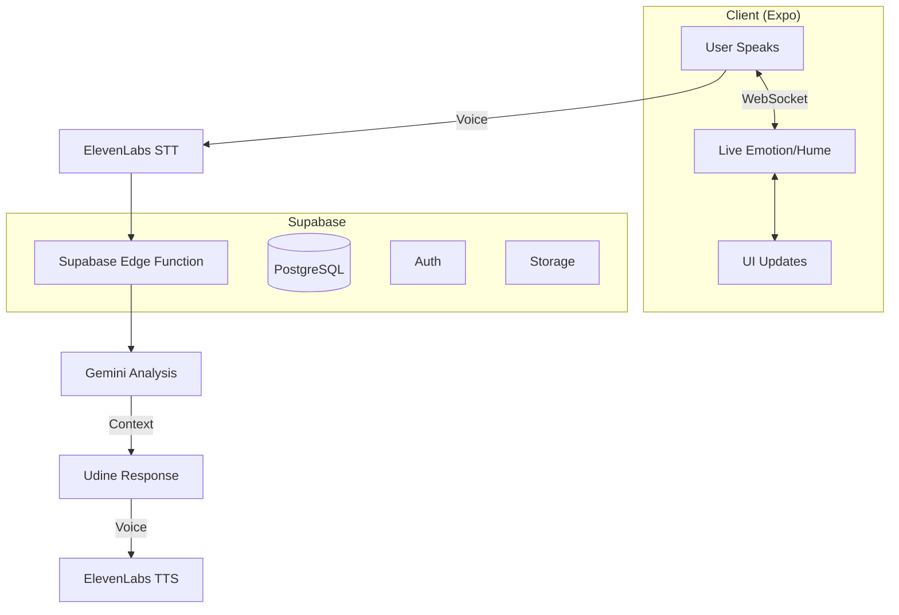

# 🧠 Understand.me – Bolt.new System Prompt

## 🎯 Core Purpose
A **voice-first conflict mediation** app using:
- 🎤 **Udine** (ElevenLabs) - Natural voice turn-taking
- 🧠 **Gemini** - Reasoning & analysis
- 🔄 **Supabase** - Data sync & auth
- ⚡ **Expo** - Cross-platform client

## 🔄 Application Flow


## 📚 Documentation Map

### 🏗️ Build Guide
| File | Purpose |
|------|---------|
| [bolt-feature-roadmap.md](./docs/bolt-feature-roadmap.md) | **Start here** – feature sequence with UI/package mapping |
| [bolt-ui-feature-guide.md](./docs/bolt-ui-feature-guide.md) | Feature implementation guide |
| [file-map.md](./docs/file-map.md) | File structure & packages |

### 🧠 AI Flow
| File | Purpose |
|------|---------|
| [analysis-engine-orchestration.md](./docs/analysis-engine-orchestration.md) | Core AI pipeline |
| [unified_architecture_specification.md](./docs/unified_architecture_specification.md) | System design |

## 🛠️ Key Components

### 1. Voice Flow (`ConvAiDOMComponent`)
ed tn s.speak(response);
  }}
/>
```

### 2. Data Sync
```typescript
// Realtime session sync
const { data } = supabase
  .channel('session_updates')
  .on('*', payload => updateUI(payload))
  .subscribe();
```

### 3. Emotion Layer
```typescript
// Hume emotion stream
hume.stream.analyze({
  data: audioBuffer,
  config: { language: 'en' }
}).on('emotion', updateEmotionUI);
```

## 🔧 Quick Start
```bash
# 1. Install deps
npx expo install @supabase/supabase-js @elevenlabs/react

# 2. Set env vars
cp .env.example .env  # Add your keys

# 3. Start dev server
expo start
```

### Required Services
1. **Supabase** - Database & Auth
2. **ElevenLabs** - Voice API
3. **Google Cloud** - Gemini API
4. **Hume** - Emotion AI (optional)

## 📦 Key Packages
```json
{
  "dependencies": {
    "ai": "^3.0.0",
    "@ai-sdk/google": "^1.0.0",
    "@elevenlabs/react": "^0.3.0",
    "hume": "^0.8.0",
    "expo-av": "~14.0.0",
    "expo-file-system": "~16.0.0"
  }
}
```

## 🤖 AI Behavior Guidelines
1. **Voice-First**: Default to voice; use text as fallback
2. **Emotion-Aware**: Adjust tone using Hume's valence/arousal
3. **Contextual**: Inject RAG snippets when relevant
4. **Concise**: Keep responses under 2 sentences unless explaining complex concepts
