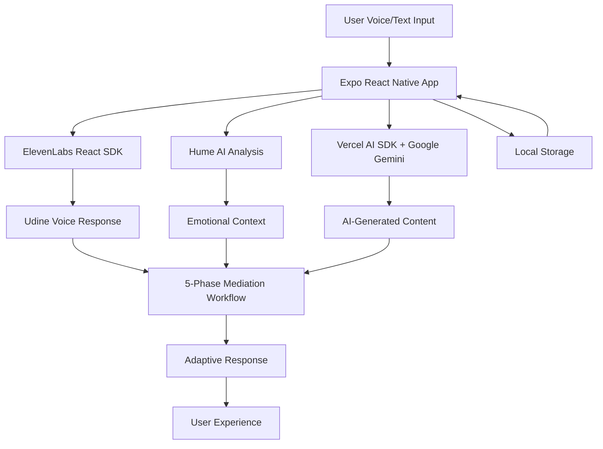

# Understand.me - Product Requirements Document (PRD)

## 1. Executive Summary

### 1.1. Product Vision
"Understand.me" is an AI-mediated communication platform that helps users navigate difficult conversations and resolve conflicts through structured, emotionally intelligent dialogue. The platform features "Udine," an AI voice agent that facilitates understanding between participants using advanced emotional intelligence and natural turn-taking conversation through a 5-phase mediation workflow.

### 1.2. Unified Architecture
**Development Environment**: bolt.new optimized for rapid development
**Platform**: Expo React Native (universal - web, iOS, Android)
**Data Storage**: Client-side local storage (AsyncStorage, browser storage)
**AI Orchestration**: Vercel AI SDK with Google Gemini models
**Voice Agent**: Udine via ElevenLabs React SDK with turn-taking conversations
**Emotional Intelligence**: Hume AI for real-time emotional analysis and adaptation
**Deployment**: Netlify static hosting for web builds

> **Definitive Technology Stack**: Expo React Native + Vercel AI SDK + Google Gemini + ElevenLabs React + Hume AI + Client-side Storage

### 1.3. Core AI Components
- **Google Gemini (via @ai-sdk/google)**: Primary LLM for conversation analysis, response generation, and 5-phase mediation workflow
- **Hume AI**: Real-time emotional intelligence analysis from voice and text inputs with mediation context adaptation
- **ElevenLabs React SDK**: Turn-taking conversational AI with Udine voice personality and natural conversation flow
- **Vercel AI SDK**: Unified client-side AI orchestration with streaming responses and state management

### 1.4. Key Differentiators
- **5-Phase Mediation Workflow**: Structured conflict resolution (Prepare → Express → Understand → Resolve → Heal)
- **Emotionally Adaptive AI**: Real-time emotional analysis that adapts conversation tone and approach
- **Natural Voice Conversations**: Turn-taking AI with Udine's warm, supportive personality
- **Universal Platform**: Single codebase for web, iOS, and Android with optimized UX
- **bolt.new Optimized**: Simplified architecture for rapid development and deployment


## 2. Technical Architecture

### 2.1. Technology Stack

#### **Core Dependencies (Current Implementation)**
```json
{
  "expo": "~53.0.13",
  "react": "19.0.0",
  "react-native": "0.79.4",
  "react-native-web": "^0.20.0",
  "@ai-sdk/google": "^1.2.19",
  "@elevenlabs/react": "^0.1.7",
  "react-native-webview": "13.13.5"
}
```

#### **AI & Voice Integration**
```bash
# AI Orchestration (Vercel AI SDK)
npm install ai @ai-sdk/google

# Voice & Emotional Intelligence
npm install @elevenlabs/react hume

# State Management (if needed)
npm install zustand

# Development Tools
npm install @types/react typescript
```

### 2.2. Environment Configuration

#### **Client Environment (.env)**
```env
# AI Services
EXPO_PUBLIC_GOOGLE_GENAI_API_KEY=your_google_genai_key
EXPO_PUBLIC_ELEVENLABS_API_KEY=your_elevenlabs_key
EXPO_PUBLIC_UDINE_AGENT_ID=your_elevenlabs_agent_id
EXPO_PUBLIC_HUME_API_KEY=your_hume_api_key

# Application
EXPO_PUBLIC_APP_ENV=development
```

### 2.3. Unified Data Flow Architecture


## 3. Core Features & User Stories

### 3.1. AI-Powered Onboarding & User Profiles
**As a new user, I want to:**
- Complete an AI-guided onboarding with Udine's voice
- Provide personality assessment through conversational interface
- Understand how emotional intelligence will enhance my experience
- Set privacy preferences for voice and emotional data

### 3.2. Udine Voice Agent (ElevenLabs Integration)
**As a user, I want to:**
- Engage in natural turn-taking conversations with Udine
- Experience emotionally adaptive responses based on Hume AI analysis
- Receive real-time guidance through the 5-phase mediation workflow
- Feel supported by a warm, empathetic AI mediator

### 3.3. 5-Phase Mediation Workflow
**Phase 1: Prepare (I1)**
- Udine sets context and establishes session framework
- Emotional baseline assessment via Hume AI
- Goal setting and communication rules establishment

**Phase 2: Express (I2)**
- Guided turn-taking for perspective sharing
- Real-time emotional monitoring and adaptation
- Active listening facilitation by Udine

**Phase 3: Understand (I3)**
- AI-guided perspective clarification
- Common ground identification
- Empathy building through structured dialogue

**Phase 4: Resolve (I4)**
- Collaborative solution brainstorming
- AI-assisted option evaluation
- Agreement drafting with emotional context

**Phase 5: Heal (I5)**
- Relationship repair focus
- Future interaction planning
- Commitment establishment and follow-up

### 3.4. Session Management (Host & Participant Paths)
**Host Path (F1-F10):**
- Describe conflict with AI analysis (F1-F2)
- Configure session type and settings (F3-F7)
- Invite participants with context sharing (F8-F9)
- Monitor responses and session readiness (F10)

**Participant Path (G1-G8):**
- Receive detailed invitations with context (G1-G3)
- Accept/decline with optional feedback (G4-G5)
- Provide perspective and configure privacy (G6-G7)
- Confirm readiness for mediation (G8)

### 3.5. Emotional Intelligence & Growth Tracking
**Hume AI Real-time Analysis:**
- Voice and text emotion detection with confidence scores
- Emotional trend tracking throughout conversations
- Adaptive response generation based on emotional context
- Intervention recommendations for emotional escalation

**Personal Growth Module (K1-K5):**
- AI-generated insights on communication patterns
- Achievement badges for constructive participation
- Personalized resource recommendations
- Future conflict prevention strategies

## 4. Technical Implementation

### 4.1. Client-Side Architecture (Expo React Native)

**Universal Application Structure:**
```typescript
// services/ai/chat.ts - Vercel AI SDK Integration
import { generateText } from 'ai';
import { google } from '@ai-sdk/google';

export async function chatWithUdine(
  history: Array<{ role: 'user' | 'assistant'; content: string }>,
  message: string,
  emotionalContext?: EmotionalAnalysis
) {
  const { text } = await generateText({
    model: google('gemini-2.0-flash-exp'),
    system: `You are Udine, a warm and empathetic conflict resolution specialist.
             Guide users through a 5-phase mediation workflow: Prepare → Express → Understand → Resolve → Heal.
             ${emotionalContext ? `Current emotional state: ${emotionalContext.primary.emotion} (${emotionalContext.primary.intensity})` : ''}`,
    messages: [...history, { role: 'user', content: message }],
  });
  return text;
}
```

**Key Implementation Components:**
- **Voice Integration**: ElevenLabs React SDK with turn-taking conversations
- **Emotional Analysis**: Hume AI real-time emotion detection and adaptation
- **AI Orchestration**: Vercel AI SDK with Google Gemini for response generation
- **State Management**: Local storage with optional Zustand for complex state
- **Cross-Platform UI**: Expo React Native components optimized for web, iOS, Android

### 4.2. ElevenLabs Voice Integration
**Udine Voice Agent Implementation:**
```typescript
// services/elevenlabs.ts
import { Conversation } from '@elevenlabs/react';

export const useUdineConversation = () => {
  const startMediationSession = async (sessionConfig: SessionConfig) => {
    return await Conversation.startSession({
      agentId: process.env.EXPO_PUBLIC_UDINE_AGENT_ID,
      onMessage: handleMediationMessage,
      onTurnChange: handleTurnChange,
      onEmotionDetected: handleEmotionChange,
      conversationConfig: {
        turnDetection: 'server_vad',
        language: 'en',
        voice: 'udine_warm_supportive'
      }
    });
  };
};
```

### 4.3. Hume AI Emotional Intelligence
**Real-time Emotional Analysis:**
```typescript
// services/hume.ts
import { HumeClient } from 'hume';

export class HumeEmotionalIntelligence {
  async analyzeVoiceEmotion(audioBuffer: ArrayBuffer): Promise<EmotionalAnalysis> {
    const response = await this.client.empathicVoice.analyze({
      audio: audioBuffer,
      models: ['prosody', 'language'],
      transcription: true
    });

    return this.processEmotionalResponse(response);
  }

  generateMediationContext(emotions: any[]): MediationContext {
    // Provides adaptive guidance for 5-phase workflow
    return {
      requiresIntervention: this.detectEscalation(emotions),
      suggestedTone: this.suggestTone(emotions),
      phaseRecommendation: this.recommendPhaseAction(emotions)
    };
  }
}
```

## 5. Development Workflow (bolt.new Optimized)

### 5.1. Project Structure (Unified Architecture)
```
understand.me/
├── components/
│   ├── voice/                 # ElevenLabs integration components
│   ├── mediation/             # 5-phase workflow UI components
│   ├── emotions/              # Hume AI visualization components
│   └── common/                # Shared UI components
├── screens/
│   ├── onboarding/            # AI-powered onboarding flow
│   ├── host/                  # Host path (F1-F10)
│   ├── participant/           # Participant path (G1-G8)
│   ├── session/               # 5-phase mediation (I1-I5)
│   └── growth/                # Growth tracking (K1-K5)
├── services/
│   ├── ai/
│   │   ├── chat.ts            # Vercel AI SDK + Google Gemini
│   │   └── mediation.ts       # 5-phase workflow logic
│   ├── elevenlabs.ts          # Udine voice agent
│   ├── hume.ts                # Emotional intelligence
│   └── storage.ts             # Local state management
├── stores/                    # Zustand stores (optional)
│   ├── conversationStore.ts   # Session state
│   ├── userStore.ts           # User profile
│   └── emotionStore.ts        # Emotional analysis data
├── types/
│   ├── mediation.ts           # 5-phase workflow types
│   ├── voice.ts               # ElevenLabs types
│   └── emotions.ts            # Hume AI types
├── utils/
│   ├── tools.ts               # Utility functions
│   └── chunker.ts             # Data processing
├── docs/                      # Unified documentation
├── App.tsx                    # Main application entry
└── package.json               # Dependencies
```

### 5.2. Environment Configuration
```bash
# AI Services (Client-side)
EXPO_PUBLIC_GOOGLE_GENAI_API_KEY=your_google_genai_key
EXPO_PUBLIC_ELEVENLABS_API_KEY=your_elevenlabs_key
EXPO_PUBLIC_UDINE_AGENT_ID=your_elevenlabs_agent_id
EXPO_PUBLIC_HUME_API_KEY=your_hume_api_key

# Application
EXPO_PUBLIC_APP_ENV=development
```

### 5.3. Development Commands (bolt.new)
```bash
# Install dependencies
npm install

# Start Expo development server
npm start

# Platform-specific development
npm run web      # Web development
npm run ios      # iOS simulator
npm run android  # Android emulator

# Production build
npm run build    # Web build for Netlify
```

## 6. Deployment Strategy (Netlify Static Hosting)

### 6.1. Netlify Configuration for Expo Web
**netlify.toml:**
```toml
[build]
  command = "npx expo export -p web"
  publish = "dist"

[build.environment]
  NODE_VERSION = "18"
  EXPO_PUBLIC_GOOGLE_GENAI_API_KEY = "your_google_genai_key"
  EXPO_PUBLIC_ELEVENLABS_API_KEY = "your_elevenlabs_key"
  EXPO_PUBLIC_UDINE_AGENT_ID = "your_elevenlabs_agent_id"
  EXPO_PUBLIC_HUME_API_KEY = "your_hume_api_key"

[[redirects]]
  from = "/*"
  to = "/index.html"
  status = 200

[[headers]]
  for = "/*"
  [headers.values]
    X-Frame-Options = "DENY"
    X-XSS-Protection = "1; mode=block"
    X-Content-Type-Options = "nosniff"
```

### 6.2. Client-Side Data Storage
**Local Storage Strategy:**
- **User Profiles**: AsyncStorage (mobile) / localStorage (web)
- **Session Data**: In-memory state with optional persistence
- **Conversation History**: Local storage with privacy controls
- **Emotional Analysis**: Temporary storage, user-controlled retention
- **No Backend Database**: Simplified architecture with client-side data management

### 6.3. Performance Optimization
**Expo Web Build Optimization:**
- Tree-shaking for minimal bundle size
- Code splitting for faster initial load
- Service worker for offline capability
- CDN delivery via Netlify Edge
- Optimized asset loading for voice and AI components

## 7. Success Metrics & KPIs

### 7.1. User Engagement & Experience
- **5-Phase Completion Rate**: >85% of sessions complete all phases
- **Voice Interaction Quality**: User satisfaction with Udine conversations >4.5/5
- **Emotional Adaptation Effectiveness**: Users report feeling understood >90%
- **User Retention**: 7-day (>60%), 30-day (>40%) retention rates
- **Session Duration**: Average 15-25 minutes for complete mediation
- **Repeat Usage**: >30% of users return for additional sessions

### 7.2. AI & Voice Performance
- **Emotional Analysis Accuracy**: Hume AI confidence scores >0.7
- **Voice Response Latency**: ElevenLabs turn-taking <2s response time
- **AI Response Relevance**: User ratings >4.0/5 for Udine's guidance
- **Conversation Flow**: Smooth phase transitions >95% of sessions
- **Conflict Resolution Success**: Mutual agreement reached >70% of sessions

### 7.3. Technical Performance (Client-Side)
- **App Load Time**: Initial load <3s on 3G networks
- **Voice Processing**: Real-time audio analysis <1s latency
- **Cross-Platform Consistency**: Feature parity >95% across web/mobile
- **Offline Capability**: Core features available without connectivity
- **Error Rates**: Client-side errors <2%, API failures <1%
- **Memory Usage**: Efficient resource management on mobile devices

### 7.4. Emotional Intelligence Impact
- **Emotional Escalation Prevention**: >80% reduction in conflict escalation
- **Empathy Building**: Increased mutual understanding scores post-session
- **Personal Growth**: Users report improved communication skills >60%
- **Intervention Effectiveness**: AI interventions lead to de-escalation >85%

## 8. Implementation Roadmap

### 8.1. Immediate Development Priorities
1. **Enhance Udine Voice Integration**: Implement full turn-taking conversation flow
2. **Complete Hume AI Integration**: Add real-time emotional analysis and adaptation
3. **Implement 5-Phase Workflow**: Build structured mediation flow with AI guidance
4. **Optimize Cross-Platform Experience**: Ensure consistent UX across web, iOS, Android

### 8.2. Development Phases (bolt.new Optimized)

**Phase 1 (Weeks 1-2): Core Voice & AI Foundation**
- Complete ElevenLabs React SDK integration with Udine agent
- Implement Vercel AI SDK with Google Gemini for conversation generation
- Basic Hume AI emotional analysis integration
- Set up 5-phase mediation workflow structure

**Phase 2 (Weeks 3-4): Mediation Workflow Implementation**
- Build complete host path (F1-F10) with conflict analysis
- Implement participant path (G1-G8) with perspective sharing
- Create 5-phase session flow (I1-I5) with emotional adaptation
- Add real-time emotional monitoring and intervention logic

**Phase 3 (Weeks 5-6): Growth & Optimization**
- Implement personal growth module (K1-K5) with insights
- Add achievement system and progress tracking
- Optimize performance for mobile and web platforms
- Complete Netlify deployment with environment configuration

**Phase 4 (Weeks 7-8): Polish & Launch**
- Comprehensive testing across all platforms
- UI/UX refinements based on user feedback
- Performance optimization and error handling
- Documentation completion and launch preparation

### 8.3. Success Criteria
- **Technical**: All core features functional across web, iOS, Android
- **User Experience**: Smooth voice interactions with <2s response times
- **AI Performance**: Emotional analysis accuracy >70%, conversation quality >4/5
- **Deployment**: Successful Netlify deployment with proper environment configuration

This updated PRD provides a clear, technically accurate roadmap for developing Understand.me with the unified architecture optimized for bolt.new development and client-side AI integration.

---

## Appendix: Technical Reference

### A.1. API Integration Patterns

**Vercel AI SDK Integration:**
```typescript
// Example: Streaming AI responses with emotional context
import { streamText } from 'ai';
import { google } from '@ai-sdk/google';

export async function generateMediationResponse(
  messages: Message[],
  phase: MediationPhase,
  emotionalContext: EmotionalAnalysis
) {
  const result = await streamText({
    model: google('gemini-2.0-flash-exp'),
    system: `You are Udine, guiding ${phase} phase of mediation.
             Current emotional state: ${emotionalContext.primary.emotion}`,
    messages,
  });

  return result.textStream;
}
```

**ElevenLabs Turn-Taking Configuration:**
```typescript
// Udine voice agent configuration
const conversationConfig = {
  agentId: process.env.EXPO_PUBLIC_UDINE_AGENT_ID,
  voice: {
    stability: 0.8,
    similarityBoost: 0.7,
    style: 0.6,
    speakingRate: 1.0
  },
  turnDetection: 'server_vad',
  language: 'en',
  conversationMode: 'mediation'
};
```

**Hume AI Emotional Analysis Integration:**
```typescript
// Real-time emotional analysis with mediation context
export class HumeEmotionalIntelligence {
  async analyzeAndAdapt(
    audioBuffer: ArrayBuffer,
    currentPhase: MediationPhase
  ): Promise<EmotionalAnalysis> {
    const analysis = await this.client.empathicVoice.analyze({
      audio: audioBuffer,
      models: ['prosody', 'language'],
      transcription: true
    });

    return {
      ...this.processEmotionalResponse(analysis),
      mediationContext: this.generateMediationContext(analysis, currentPhase)
    };
  }
}
```

### A.2. Data Storage & Privacy

**Client-Side Storage Strategy:**
- **User Profiles**: AsyncStorage (mobile) / localStorage (web)
- **Session State**: In-memory with optional local persistence
- **Conversation History**: Local storage with user-controlled retention
- **Emotional Data**: Temporary analysis, privacy-first approach
- **Voice Recordings**: Processed in memory, not persisted by default

**Privacy Controls:**
- User-controlled data retention policies
- Local-first data storage approach
- Transparent emotional analysis usage
- Optional conversation history export
- Clear data deletion capabilities

### A.3. Development Best Practices

**bolt.new Optimization:**
- Use client-side AI integration patterns
- Minimize external dependencies
- Focus on Expo React Native universal compatibility
- Implement progressive enhancement for advanced features

**Performance Considerations:**
- Lazy load AI models and voice components
- Implement efficient state management with Zustand
- Use React.memo for expensive emotion visualization components
- Optimize bundle size for web deployment

## 2. Technical Architecture

### 2.1. System Overview

Understand.me is built as a cross-platform application using modern web technologies with a focus on AI-powered communication analysis and voice interaction. The system consists of:

- **Frontend**: Expo-based mobile app with web support
- **Backend**: Express.js server deployed on Netlify
- **AI Engine**: Google GenAI 1.5.0 for multimodal analysis
- **Voice System**: ElevenLabs turn-taking AI with Udine voice
- **Analysis Engine**: LangChain JS with community plugins for RAG and memory
- **Emotional Intelligence**: Hume AI integration
- **Database**: Supabase for data persistence
- **Storage**: Supabase Storage for media files

### 2.2. Frontend Architecture

#### 2.2.1. Expo Universal App Structure

```
understand-me/
├── app/                    # Expo Router app directory (when using Expo Router)
│   ├── (tabs)/            # Tab-based navigation
│   ├── session/           # Session-related screens
│   ├── profile/           # User profile screens
│   └── _layout.tsx        # Root layout
├── components/            # Reusable UI components
│   ├── ui/               # Base UI components
│   ├── voice/            # Voice interaction components
│   ├── analysis/         # Analysis visualization components
│   └── session/          # Session management components
├── services/             # API and service layer
│   ├── ai/              # AI-related services
│   ├── api.ts           # API client configuration
│   ├── voice.ts         # ElevenLabs integration
│   ├── analysis.ts      # AI analysis services
│   └── storage.ts       # File upload/download
├── hooks/               # Custom React hooks
├── utils/               # Utility functions
├── types/               # TypeScript type definitions
├── assets/              # Static assets (images, fonts, etc.)
├── App.tsx              # Main app component (when not using Expo Router)
├── app.json             # Expo configuration
├── package.json         # Dependencies and scripts
└── tsconfig.json        # TypeScript configuration
```

#### 2.2.2. Key Technologies

- **Expo SDK 52+**: Universal app platform
- **Expo Router**: File-based routing system
- **React Native**: Cross-platform mobile development
- **TypeScript**: Type-safe development
- **Expo DOM Components**: Web technologies in native apps
- **ElevenLabs React SDK**: Voice interaction
- **Expo AV**: Audio playback and recording
- **Expo Image Picker**: Media capture
- **Expo Document Picker**: File selection

### 2.3. Backend Architecture

#### 2.3.1. Netlify Functions Structure

```
understand-me/
├── netlify/
│   └── functions/        # Netlify serverless functions
│       ├── auth.ts      # Authentication endpoints
│       ├── sessions.ts  # Session management
│       ├── analysis.ts  # AI analysis endpoints
│       ├── voice.ts     # Voice processing
│       └── shared/      # Shared utilities for functions
│           ├── aiEngine.ts  # Google GenAI integration
│           ├── voiceService.ts # ElevenLabs integration
│           ├── analysisEngine.ts # LangChain orchestration
│           ├── humeService.ts # Hume AI integration
│           ├── middleware.ts # Common middleware
│           ├── models.ts    # Data models and schemas
│           └── utils.ts     # Utility functions
├── netlify.toml         # Netlify deployment config
└── package.json         # Dependencies and scripts
```

#### 2.3.2. Deployment Configuration

**netlify.toml**:
```toml
[build]
  command = "npm run build"
  functions = "netlify/functions"
  publish = "dist"

[functions]
  node_bundler = "esbuild"
  directory = "netlify/functions"

[[redirects]]
  from = "/api/auth/*"
  to = "/.netlify/functions/auth"
  status = 200

[[redirects]]
  from = "/api/sessions/*"
  to = "/.netlify/functions/sessions"
  status = 200

[[redirects]]
  from = "/api/analysis/*"
  to = "/.netlify/functions/analysis"
  status = 200

[[redirects]]
  from = "/api/voice/*"
  to = "/.netlify/functions/voice"
  status = 200
```

### 2.4. AI Engine Architecture

#### 2.4.1. Google GenAI Integration

```typescript
// Core AI service using Google GenAI 1.5.0
import { GoogleGenAI } from '@google/genai';

const genAI = new GoogleGenerativeAI(process.env.GOOGLE_GENAI_API_KEY);

// Multimodal analysis model
const multimodalModel = genAI.getGenerativeModel({
  model: 'gemini-1.5-pro'
});

// Text analysis model
const textModel = genAI.getGenerativeModel({
  model: 'gemini-1.5-flash'
});
```

#### 2.4.2. LangChain Analysis Engine

```typescript
// LangChain community integration for RAG and memory
import { ChatGoogleGenerativeAI } from '@langchain/google-genai';
import { MemoryVectorStore } from 'langchain/vectorstores/memory';
import { GoogleGenerativeAIEmbeddings } from '@langchain/google-genai';
import { ConversationChain } from 'langchain/chains';
import { BufferMemory } from 'langchain/memory';

const llm = new ChatGoogleGenerativeAI({
  modelName: 'gemini-1.5-pro',
  apiKey: process.env.GOOGLE_GENAI_API_KEY,
});

const embeddings = new GoogleGenerativeAIEmbeddings({
  apiKey: process.env.GOOGLE_GENAI_API_KEY,
});

const vectorStore = new MemoryVectorStore(embeddings);
const memory = new BufferMemory();
```

### 2.5. Voice System Architecture

#### 2.5.1. ElevenLabs Turn-Taking Integration

```typescript
// ElevenLabs turn-taking AI with Udine voice
import { ElevenLabsClient } from '@elevenlabs/react';

const client = new ElevenLabsClient({
  apiKey: process.env.ELEVENLABS_API_KEY,
});

// Udine voice configuration
const UDINE_VOICE_ID = 'your-udine-voice-id';

const voiceSettings = {
  stability: 0.5,
  similarity_boost: 0.8,
  style: 0.2,
  use_speaker_boost: true,
};
```

#### 2.5.2. Turn-Taking Conversation Flow

```typescript
// Conversation management with turn-taking
class ConversationManager {
  private isListening = false;
  private isSpeaking = false;

  async startConversation() {
    // Initialize turn-taking session
    const session = await client.createConversationSession({
      voiceId: UDINE_VOICE_ID,
      turnTaking: true,
      voiceSettings,
    });

    return session;
  }

  async handleUserInput(audioData: ArrayBuffer) {
    if (this.isSpeaking) return; // Don't interrupt AI

    this.isListening = true;
    // Process user input through analysis engine
    const analysis = await this.analyzeInput(audioData);

    // Generate AI response
    const response = await this.generateResponse(analysis);

    // Synthesize and play voice response
    await this.speakResponse(response);
  }
}
```

### 2.6. Data Architecture


#### 2.6.2. File Storage Structure

```
supabase-storage/
├── sessions/
│   ├── {session-id}/
│   │   ├── audio/          # Audio recordings
│   │   ├── documents/      # Uploaded documents
│   │   ├── images/         # Image uploads
│   │   └── transcripts/    # Generated transcripts
├── users/
│   └── {user-id}/
│       ├── profile/        # Profile images
│       └── uploads/        # User-uploaded content
└── analysis/
    └── {session-id}/
        ├── emotional/      # Emotional analysis data
        ├── patterns/       # Communication patterns
        └── summaries/      # Session summaries
```

## 3. Development Workflow

### 3.1. Bolt.new Development Rules Integration

This project follows specific development patterns optimized for bolt.new workflows:

#### 3.1.1. File Structure Conventions

- **Single-purpose files**: Each file should have a clear, single responsibility
- **Descriptive naming**: Use clear, descriptive names for files and directories
- **Consistent imports**: Use absolute imports with path mapping where possible
- **Type-first development**: Define TypeScript interfaces before implementation

#### 3.1.2. Component Development Patterns

```typescript
// Component structure template
import React from 'react';
import { StyleSheet, View } from 'react-native';

interface ComponentProps {
  // Define props interface first
}

export function ComponentName({ ...props }: ComponentProps) {
  // Component implementation
  return (
    <View style={styles.container}>
      {/* Component content */}
    </View>
  );
}

const styles = StyleSheet.create({
  container: {
    // Styles
  },
});
```

#### 3.1.3. Service Layer Patterns

```typescript
// Service structure template
export class ServiceName {
  private config: ServiceConfig;

  constructor(config: ServiceConfig) {
    this.config = config;
  }

  async methodName(params: MethodParams): Promise<MethodResult> {
    // Implementation with proper error handling
    try {
      // Service logic
      return result;
    } catch (error) {
      console.error(`ServiceName.methodName error:`, error);
      throw new Error(`Failed to execute methodName: ${error.message}`);
    }
  }
}
```

### 3.2. Development Environment Setup

#### 3.2.1. Prerequisites

```bash
# Node.js and package manager
node --version  # v18.0.0 or higher
npm --version   # v9.0.0 or higher

# Expo CLI
npm install -g @expo/cli

# Development tools
npm install -g typescript
npm install -g @types/node
```

#### 3.2.2. Project Initialization

```bash
# Create Expo project
npx create-expo-app@latest understand-me --template blank-typescript

# Navigate to project
cd understand-me

# Install core dependencies
npx expo install expo-router expo-av expo-image-picker expo-document-picker
npx expo install @elevenlabs/react expo-dev-client
npx expo install react-dom react-native-web @expo/metro-runtime

# Install backend dependencies
npm install express cors helmet morgan
npm install @google/genai @elevenlabs/client
npm install @langchain/google-genai langchain
npm install @supabase/supabase-js

# Install development dependencies
npm install -D @types/express @types/cors @types/morgan
npm install -D nodemon ts-node typescript
```

#### 3.2.3. Environment Configuration

**.env.local**:
```env
# Google GenAI
GOOGLE_GENAI_API_KEY=your_google_genai_api_key

# ElevenLabs
ELEVENLABS_API_KEY=your_elevenlabs_api_key
ELEVENLABS_VOICE_ID=your_udine_voice_id

# Hume AI
HUME_API_KEY=your_hume_api_key

# Supabase
SUPABASE_URL=your_supabase_url
SUPABASE_ANON_KEY=your_supabase_anon_key
SUPABASE_SERVICE_ROLE_KEY=your_supabase_service_role_key

# App Configuration
NODE_ENV=development
PORT=3000
```

### 3.3. Development Scripts

**package.json scripts**:
```json
{
  "scripts": {
    "start": "expo start",
    "start:web": "expo start --web",
    "start:ios": "expo start --ios",
    "start:android": "expo start --android",
    "build": "expo build",
    "build:web": "expo build:web",
    "server:dev": "nodemon server/src/app.ts",
    "server:build": "tsc -p server/tsconfig.json",
    "server:start": "node server/dist/app.js",
    "test": "jest",
    "test:watch": "jest --watch",
    "lint": "eslint . --ext .ts,.tsx,.js,.jsx",
    "lint:fix": "eslint . --ext .ts,.tsx,.js,.jsx --fix",
    "type-check": "tsc --noEmit"
  }
}
```

### 3.4. Testing Strategy

#### 3.4.1. Frontend Testing

```typescript
// Component testing with React Native Testing Library
import { render, fireEvent } from '@testing-library/react-native';
import { VoiceInteractionComponent } from '../VoiceInteractionComponent';

describe('VoiceInteractionComponent', () => {
  it('should start recording when record button is pressed', () => {
    const { getByTestId } = render(<VoiceInteractionComponent />);
    const recordButton = getByTestId('record-button');

    fireEvent.press(recordButton);

    expect(getByTestId('recording-indicator')).toBeTruthy();
  });
});
```

#### 3.4.2. Backend Testing

```typescript
// API endpoint testing with Jest and Supertest
import request from 'supertest';
import { app } from '../src/app';

describe('POST /api/analysis/voice', () => {
  it('should analyze voice input and return emotional state', async () => {
    const response = await request(app)
      .post('/api/analysis/voice')
      .attach('audio', 'test-audio.wav')
      .expect(200);

    expect(response.body).toHaveProperty('emotionalState');
    expect(response.body).toHaveProperty('confidence');
  });
});
```

### 3.5. Deployment Workflow

#### 3.5.1. Netlify Deployment

```bash
# Build for production
npm run server:build
npm run build:web

# Deploy to Netlify
netlify deploy --prod --dir=dist
```

#### 3.5.2. Mobile App Deployment

```bash
# Build for iOS
expo build:ios

# Build for Android
expo build:android

# Submit to app stores
expo submit:ios
expo submit:android
```

### 3.6. Code Quality Standards

#### 3.6.1. TypeScript Configuration

**tsconfig.json**:
```json
{
  "compilerOptions": {
    "target": "ES2020",
    "module": "ESNext",
    "moduleResolution": "node",
    "strict": true,
    "esModuleInterop": true,
    "skipLibCheck": true,
    "forceConsistentCasingInFileNames": true,
    "resolveJsonModule": true,
    "allowSyntheticDefaultImports": true,
    "jsx": "react-jsx",
    "baseUrl": ".",
    "paths": {
      "@/*": ["./*"],
      "@/components/*": ["components/*"],
      "@/services/*": ["services/*"],
      "@/utils/*": ["utils/*"],
      "@/types/*": ["types/*"],
      "@/hooks/*": ["hooks/*"]
    }
  }
}
```

#### 3.6.2. ESLint Configuration

**.eslintrc.js**:
```javascript
module.exports = {
  extends: [
    'expo',
    '@react-native-community',
    'plugin:@typescript-eslint/recommended',
  ],
  parser: '@typescript-eslint/parser',
  plugins: ['@typescript-eslint'],
  rules: {
    '@typescript-eslint/no-unused-vars': 'error',
    '@typescript-eslint/explicit-function-return-type': 'warn',
    'react-hooks/exhaustive-deps': 'warn',
    'no-console': 'warn',
  },
};
```

## 4. Implementation Roadmap

### 4.1. Phase 1: Foundation Setup (Week 1-2)

#### 4.1.1. Project Initialization
- [ ] Set up Expo project with TypeScript template
- [ ] Configure development environment and dependencies
- [ ] Set up Supabase database and authentication
- [ ] Create basic project structure and routing
- [ ] Implement environment configuration management

#### 4.1.2. Core Infrastructure
- [ ] Set up Express.js backend with Netlify deployment
- [ ] Configure CORS and security middleware
- [ ] Implement basic API structure and error handling
- [ ] Set up database migrations and seed data
- [ ] Configure file storage with Supabase Storage

#### 4.1.3. Authentication System
- [ ] Implement user registration and login
- [ ] Set up JWT token management
- [ ] Create protected route middleware
- [ ] Build user profile management
- [ ] Implement password reset functionality

### 4.2. Phase 2: AI Engine Development (Week 3-4)

#### 4.2.1. Google GenAI Integration
- [ ] Set up Google GenAI client and configuration
- [ ] Implement text analysis service
- [ ] Create multimodal input processing
- [ ] Build conversation context management
- [ ] Add error handling and fallback mechanisms

#### 4.2.2. LangChain Analysis Engine
- [ ] Configure LangChain with Google GenAI
- [ ] Implement RAG (Retrieval-Augmented Generation)
- [ ] Set up conversation memory management
- [ ] Create document processing pipeline
- [ ] Build pattern recognition system

#### 4.2.3. Hume AI Emotional Intelligence
- [ ] Integrate Hume AI API
- [ ] Implement emotional state detection
- [ ] Create emotional trend analysis
- [ ] Build emotional context mapping
- [ ] Add emotional insights generation

### 4.3. Phase 3: Voice System Implementation (Week 5-6)

#### 4.3.1. ElevenLabs Integration
- [ ] Set up ElevenLabs client with Udine voice
- [ ] Implement turn-taking conversation system
- [ ] Create voice synthesis service
- [ ] Build audio streaming capabilities
- [ ] Add voice quality optimization

#### 4.3.2. Audio Processing
- [ ] Implement audio recording with Expo AV
- [ ] Create audio file upload and storage
- [ ] Build real-time audio streaming
- [ ] Add audio format conversion
- [ ] Implement noise reduction and enhancement

#### 4.3.3. Voice UI Components
- [ ] Create voice interaction interface
- [ ] Build recording state management
- [ ] Implement playback controls
- [ ] Add visual feedback for voice activity
- [ ] Create accessibility features for voice interaction

### 4.4. Phase 4: Session Management (Week 7-8)

#### 4.4.1. Session Creation and Management
- [ ] Build session creation workflow
- [ ] Implement participant invitation system
- [ ] Create session configuration options
- [ ] Build session state management
- [ ] Add session scheduling functionality

#### 4.4.2. Real-time Communication
- [ ] Implement WebSocket connection for real-time updates
- [ ] Create participant presence indicators
- [ ] Build real-time message synchronization
- [ ] Add connection state management
- [ ] Implement reconnection logic

#### 4.4.3. Session Analytics
- [ ] Create session progress tracking
- [ ] Implement participation metrics
- [ ] Build communication pattern analysis
- [ ] Add session effectiveness scoring
- [ ] Create insights dashboard

### 4.5. Phase 5: User Interface Development (Week 9-10)

#### 4.5.1. Mobile App UI
- [ ] Design and implement main navigation
- [ ] Create session list and detail screens
- [ ] Build user profile and settings screens
- [ ] Implement responsive design patterns
- [ ] Add dark mode support

#### 4.5.2. Web Interface
- [ ] Create responsive web layout
- [ ] Implement web-specific navigation
- [ ] Build desktop-optimized components
- [ ] Add keyboard shortcuts and accessibility
- [ ] Optimize for different screen sizes

#### 4.5.3. Analysis Visualization
- [ ] Create emotional state visualizations
- [ ] Build communication pattern charts
- [ ] Implement progress tracking displays
- [ ] Add interactive analysis components
- [ ] Create exportable reports

### 4.6. Phase 6: Testing and Optimization (Week 11-12)

#### 4.6.1. Comprehensive Testing
- [ ] Write unit tests for all components
- [ ] Implement integration tests for API endpoints
- [ ] Create end-to-end tests for user workflows
- [ ] Add performance testing for AI services
- [ ] Implement accessibility testing

#### 4.6.2. Performance Optimization
- [ ] Optimize AI service response times
- [ ] Implement caching strategies
- [ ] Reduce bundle size and load times
- [ ] Optimize database queries
- [ ] Add monitoring and analytics

#### 4.6.3. Security and Privacy
- [ ] Implement data encryption at rest and in transit
- [ ] Add privacy controls and data deletion
- [ ] Create audit logging system
- [ ] Implement rate limiting and abuse prevention
- [ ] Conduct security vulnerability assessment

### 4.7. Phase 7: Deployment and Launch (Week 13-14)

#### 4.7.1. Production Deployment
- [ ] Set up production Netlify environment
- [ ] Configure production Supabase instance
- [ ] Implement CI/CD pipeline
- [ ] Set up monitoring and alerting
- [ ] Create backup and disaster recovery plan

#### 4.7.2. Mobile App Store Deployment
- [ ] Prepare app store listings and metadata
- [ ] Create app screenshots and promotional materials
- [ ] Submit to Apple App Store and Google Play Store
- [ ] Implement app update mechanisms
- [ ] Set up crash reporting and analytics

#### 4.7.3. Launch Preparation
- [ ] Create user documentation and tutorials
- [ ] Set up customer support system
- [ ] Implement feedback collection mechanisms
- [ ] Prepare marketing materials
- [ ] Plan soft launch and beta testing program

### 4.8. Success Metrics and KPIs

#### 4.8.1. Technical Metrics
- **API Response Time**: < 2 seconds for AI analysis
- **Voice Latency**: < 500ms for turn-taking conversations
- **App Load Time**: < 3 seconds on mobile devices
- **Uptime**: 99.9% availability
- **Error Rate**: < 1% for critical user flows

#### 4.8.2. User Experience Metrics
- **Session Completion Rate**: > 80%
- **User Retention**: > 60% after 30 days
- **Voice Interaction Success**: > 90% successful voice exchanges
- **User Satisfaction**: > 4.5/5 average rating
- **Feature Adoption**: > 70% for core features

#### 4.8.3. Business Metrics
- **User Acquisition**: Track monthly active users
- **Session Volume**: Monitor sessions per user per month
- **Engagement**: Measure time spent in sessions
- **Conversion**: Track free to paid user conversion
- **Support Tickets**: < 5% of users requiring support

---

*This PRD provides a comprehensive, technically accurate guide for developing Understand.me with the unified architecture, ensuring consistency between documentation and implementation while optimizing for bolt.new development workflows.*


