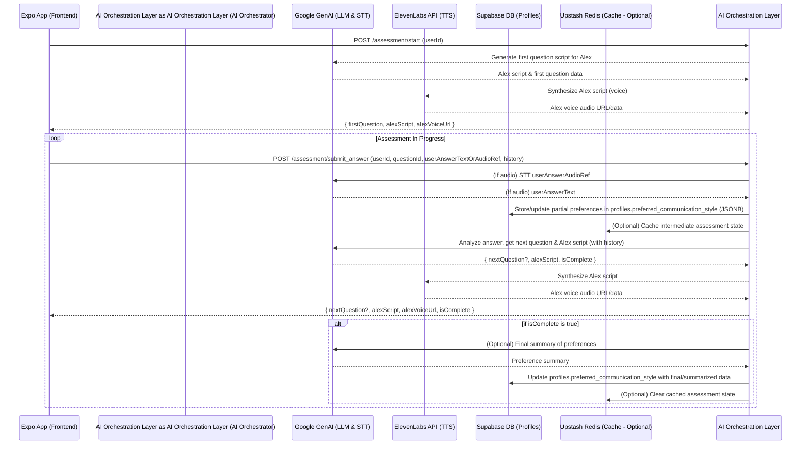
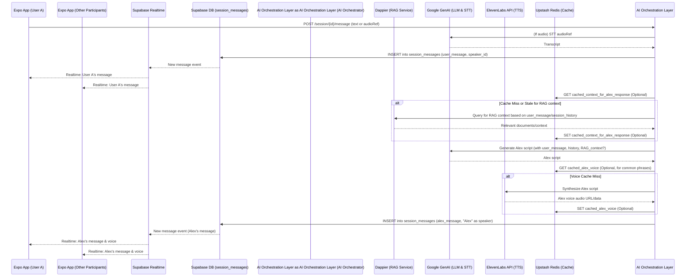
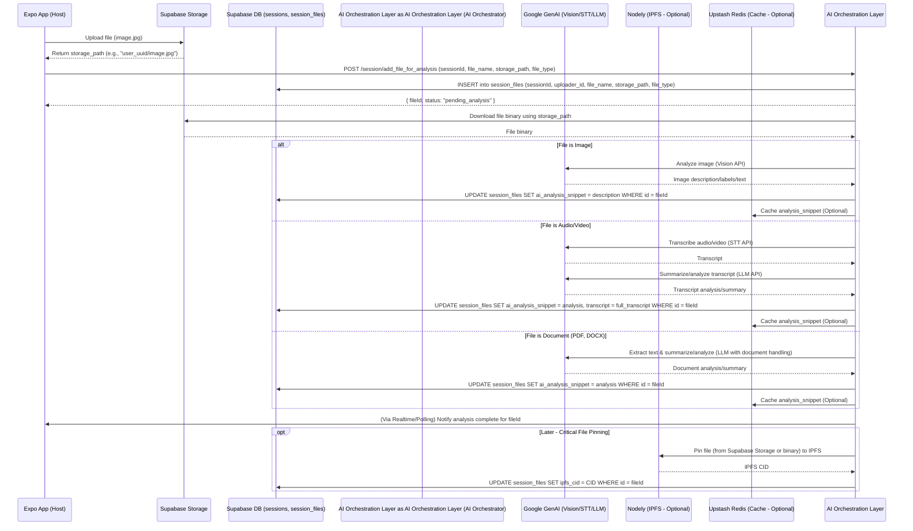

# Part 4: Data Flow Architecture Details

## Introduction

Understanding the flow of data is critical in a distributed, serverless architecture like "Understand.me." This part of the Technical Product Knowledge Base (TPKB) provides detailed diagrams and explanations for key complex features, illustrating how data moves between the Expo (React Native) mobile app, AI Orchestration Layer (AI Orchestration), Supabase (BaaS), and other integrated services (Google GenAI, ElevenLabs, Dappier, Nodely, Upstash Redis).

These data flows aim to clarify:
*   The sequence of operations for specific user actions or system processes.
*   The responsibilities of each service at each step.
*   The conceptual data schemas or payloads being exchanged.
*   Significant data transformations or processing logic.

A clear grasp of these flows is essential for developers to debug issues, implement new functionalities consistently, and understand the system's overall behavior.

---

## Data Flow 1: Conversational Personality Assessment (UI Guide 2.3, Dev Guide 6.X/6.1.4)

**Goal:** To capture user's communication preferences through a guided, conversational interaction with Alex and store these preferences.

**Mermaid Sequence Diagram:**

**Textual Explanation:**

1.  **Initiation (Expo App -> AI Orchestration Layer):**
    *   User navigates to the assessment screen. Expo app sends a request to AI Orchestration Layer (e.g., `POST /assessment/start`) with the `userId`.
    *   **Payload:** `{ userId: string }`
2.  **First Question Generation (AI Orchestration Layer -> Google GenAI -> ElevenLabs -> AI Orchestration Layer -> ExpoApp):**
    *   AI Orchestration Layer requests the initial assessment question and Alex's introductory script from Google GenAI.
    *   Google GenAI returns the script and question data.
    *   AI Orchestration Layer sends the script to ElevenLabs for voice synthesis.
    *   AI Orchestration Layer returns the first question details, Alex's text script, and the voice audio URL to the Expo app.
    *   **Payload (AI Orchestration Layer to ExpoApp):** `{ question: { id: 'q1', text: '...', options: [...] }, alexScript: "Hi...", alexVoiceUrl: "..." }`
3.  **User Response Loop (Expo App -> AI Orchestration Layer -> ... -> ExpoApp):**
    *   **User Input (Expo App):** User provides an answer (text or voice). Voice is recorded using `expo-av`.
    *   **Submit Answer (Expo App to AI Orchestration Layer):** App sends `userId`, `questionId`, the answer (text or audio reference like a Supabase Storage path if uploaded first for STT), and conversation history to AI Orchestration Layer (e.g., `POST /assessment/submit_answer`).
        *   **Payload:** `{ userId: string, questionId: string, answerText?: string, answerAudioRef?: string, history: [{speaker: 'user'|'alex', text: string}] }`
    *   **AI Orchestration Layer Orchestration:**
        *   **STT (if audio):** If `answerAudioRef` is present, AI Orchestration Layer retrieves audio and sends to Google GenAI STT.
        *   **Store Partial Preference:** AI Orchestration Layer updates the `profiles.preferred_communication_style` JSONB field in Supabase with the latest understood preference from the answer. This could be an incremental update.
        *   **Cache State (Optional):** AI Orchestration Layer might cache the current assessment state (e.g., current question, history) in Upstash Redis for resilience or to manage stateless AI Orchestration Layer instances.
        *   **Next Step from GenAI:** AI Orchestration Layer sends the (transcribed) answer and conversation history to Google GenAI, prompting for analysis, the next question/statement from Alex, and whether the assessment is complete.
        *   **Voice Synthesis:** AI Orchestration Layer gets Alex's new script voiced by ElevenLabs.
    *   **Response to Expo App:** AI Orchestration Layer returns `{ nextQuestion?: { id: 'q2', ... }, alexScript: "...", alexVoiceUrl: "...", isComplete: boolean }`.
    *   **UI Update:** Expo app displays Alex's response and the next question.
4.  **Assessment Completion:**
    *   When Google GenAI (via AI Orchestration Layer) indicates `isComplete: true`:
        *   AI Orchestration Layer may perform a final call to Google GenAI to get a consolidated summary of all preferences.
        *   AI Orchestration Layer makes a final update to `profiles.preferred_communication_style` in Supabase with the complete/summarized assessment data.
        *   AI Orchestration Layer may clear any cached assessment state from Upstash Redis.
        *   Expo app navigates to the next onboarding step (e.g., Interactive Tutorial).

---

## Data Flow 2: Real-time AI-Mediated Session Message (with RAG) (UI Guide Part 7)

**Goal:** To process a user's message during a live session, potentially augment Alex's response with external knowledge via Dappier (RAG), and broadcast the message and Alex's response to all participants in real-time.

**Mermaid Sequence Diagram:**

**Textual Explanation:**

1.  **User Sends Message (Expo App -> AI Orchestration Layer):**
    *   Participant A speaks (audio captured by `expo-av`, sent as chunks or reference) or types a message (`<TextInput>`).
    *   Expo app sends this to AI Orchestration Layer: `POST /session/{sessionId}/message`
    *   **Payload:** `{ userId: string, textPayload?: string, audioReference?: string, currentPhase: string, sessionHistorySummary?: string }`
2.  **AI Orchestration Layer: Initial Processing & User Message Persistence:**
    *   **STT (if audio):** AI Orchestration Layer sends audio data/reference to Google GenAI STT.
    *   **Store User Message:** AI Orchestration Layer takes the transcribed text (or original typed text) and instructs Supabase (directly or via Edge Function) to insert it into `session_messages`.
        *   **Data:** `{ session_id, profile_id (speaker), message_type: 'user_speech_transcript' | 'user_typed_message', content: string }`
3.  **Supabase Realtime Broadcast (User Message):**
    *   The insert into `session_messages` triggers Supabase Realtime.
    *   All subscribed clients (User A's app, Other Participants' apps) receive the new message.
    *   Expo apps update their local message list (`<FlatList>`) to display User A's message.
4.  **AI Orchestration Layer: Alex's Response Formulation (RAG & LLM):**
    *   **Context Retrieval (Dappier RAG - Optional):**
        *   AI Orchestration Layer analyzes User A's message and recent conversation history (potentially cached in Upstash Redis or fetched from Supabase).
        *   If the context suggests a need for external information (as per session type or specific keywords), AI Orchestration Layer queries Dappier with relevant search terms.
        *   Dappier returns relevant document chunks/information. This retrieved context could be cached in Upstash Redis by AI Orchestration Layer if the query is likely to repeat.
    *   **Prompt Construction:** AI Orchestration Layer constructs a prompt for Google GenAI (LLM) including:
        *   User A's message.
        *   Relevant conversation history (summarized if long).
        *   Retrieved context from Dappier (if any).
        *   Current session phase, goals, rules.
        *   Participant personality profiles (if relevant for tailoring Alex's response style).
        *   Instructions for Alex's role (e.g., "clarify," "summarize," "mediate," "check for understanding").
    *   **Google GenAI Call:** AI Orchestration Layer sends the prompt to Google GenAI.
    *   Google GenAI returns Alex's scripted response (text).
5.  **AI Orchestration Layer: Alex's Voice Synthesis & Message Persistence:**
    *   **Voice Caching (Optional):** AI Orchestration Layer checks Upstash Redis for a cached audio URL for this exact script (if it's a common phrase).
    *   **ElevenLabs TTS:** If not cached or stale, AI Orchestration Layer sends the script to ElevenLabs. ElevenLabs returns audio URL/data. AI Orchestration Layer caches this if appropriate.
    *   **Store Alex's Message:** AI Orchestration Layer instructs Supabase to insert Alex's message (text and voice URL) into `session_messages`.
        *   **Data:** `{ session_id, profile_id: 'alex_ai_id', message_type: 'alex_guidance', content: string, voice_url: string }`
6.  **Supabase Realtime Broadcast (Alex's Message):**
    *   The insert of Alex's message triggers Supabase Realtime.
    *   All subscribed clients receive Alex's message.
    *   Expo apps update their UI to display Alex's text and play the audio via `expo-av` (Component 10.2).

---

## Data Flow 3: Multimedia File Analysis & Contextualization (UI Guide 4.1, 4.2, 7.1.D)

**Goal:** To allow a host to upload a multimedia file, have it analyzed by AI, and the analysis results made available for session preparation and referenced during the live session.

**Mermaid Sequence Diagram:**

**Textual Explanation:**

1.  **File Upload (Expo App to Supabase Storage - Component 10.3):**
    *   Host selects a file using `expo-document-picker` or `expo-image-picker`.
    *   Expo app uploads the file directly to a designated Supabase Storage bucket.
    *   **Payload:** File binary.
    *   Supabase Storage returns a unique `storage_path`.
2.  **Inform AI Orchestration Layer & Initial Record (Expo App to AI Orchestration Layer):**
    *   Expo app sends file metadata (including `storage_path`, original `file_name`, `file_type`) and the relevant `session_id` (or prospective session ID if conflict description stage) to AI Orchestration Layer (e.g., `POST /session/add_file_for_analysis`).
    *   **Payload:** `{ sessionId: string, fileName: string, storagePath: string, fileType: string, uploaderId: string }`
    *   AI Orchestration Layer creates a record in `session_files` table in Supabase, linking the file to the session and uploader, storing its path and type. Initially, `ai_analysis_snippet` might be null.
    *   AI Orchestration Layer returns a `fileId` and status (e.g., "pending_analysis") to the Expo app.
3.  **AI Orchestration Layer: File Retrieval & AI Analysis Orchestration:**
    *   AI Orchestration Layer (can be an asynchronous process triggered by the previous step) retrieves the file binary from Supabase Storage using the `storage_path`.
    *   **Content-Specific Analysis (AI Orchestration Layer -> Google GenAI):**
        *   **Images:** AI Orchestration Layer sends image binary to Google GenAI Vision model for description, object detection, or text extraction.
        *   **Audio/Video:** AI Orchestration Layer sends audio/video to Google GenAI STT (or ElevenLabs STT) for transcription. The transcript may then be sent to a GenAI LLM for summarization or key point extraction.
        *   **Documents (PDF, DOCX):** AI Orchestration Layer sends the document (or extracted text via a utility) to a Google GenAI LLM capable of document understanding/summarization.
    *   Google GenAI returns the structured analysis (e.g., description, labels, transcript, summary) to AI Orchestration Layer.
4.  **AI Orchestration Layer: Store & Cache Analysis:**
    *   AI Orchestration Layer updates the corresponding `session_files` record in Supabase with the `ai_analysis_snippet` and full transcript if applicable.
    *   AI Orchestration Layer may cache this `ai_analysis_snippet` in Upstash Redis using a key like `file_analysis:{fileId}` for quick retrieval by the Expo app when displaying file details or by AI Orchestration Layer itself during broader session synthesis.
5.  **Notification of Completion (AI Orchestration Layer to Expo App):**
    *   AI Orchestration Layer notifies the Expo app (e.g., via Supabase Realtime subscription on `session_files` or a specific notification channel) that analysis for `fileId` is complete.
    *   Expo app can then update its UI to show the snippet or indicate readiness for review (e.g., in UI Guide 4.2).
6.  **Contextual Use In-Session (UI Guide 7.1.D):**
    *   During a live session, if Alex or a user refers to this file, AI Orchestration Layer can quickly fetch the `ai_analysis_snippet` (from Redis or Supabase) and provide it to Google GenAI as part of the context for generating Alex's next response, or display it in the AI Panel.
7.  **Optional IPFS Pinning (AI Orchestration Layer -> Nodely -> Supabase):**
    *   At a later stage (e.g., if file is deemed critical evidence or part of a final agreement), AI Orchestration Layer or a Supabase Edge Function can retrieve the file from Supabase Storage and use Nodely to pin it to IPFS.
    *   The returned IPFS CID is then updated in the `session_files.ipfs_cid` field in Supabase. Retrieval for display in Expo would then use a Nodely/IPFS gateway URL.
