# Understand.me: Complete Platform Documentation

## Table of Contents

1. [Project Overview](#project-overview)
2. [UX/UI Design Specifications](#uxui-design-specifications)
3. [Technical Architecture](#technical-architecture)
4. [Implementation Roadmap](#implementation-roadmap)
5. [Team Structure & Resources](#team-structure--resources)

---

## Project Overview

**Understand.me** is an AI-mediated conflict resolution Progressive Web Application (PWA) that helps users navigate interpersonal disputes through structured, AI-guided sessions. The platform supports both individual coaching and joint mediation sessions, with a unique focus on same-device interactions for intimate conflicts.

### Core Vision & Value Proposition

- **Primary Goal**: Provide accessible, AI-mediated conflict resolution that fosters understanding and promotes personal growth
- **Target Users**: Individuals seeking structured conflict resolution (couples, family members, colleagues, friends)
- **Platform Type**: Progressive Web Application (PWA) with offline capabilities
- **Key Differentiator**: Dynamic AI adaptation based on personality assessment and real-time emotional analysis

### Key Features

#### Core Functionality
- **AI-Powered Conflict Analysis**: Google GenAI SDK for intelligent conflict understanding
- **Voice Integration**: ElevenLabs API for natural voice interactions
- **Five-Phase Mediation**: Structured approach (Prepare, Express, Understand, Resolve, Heal)
- **Same-Device Sessions**: Unique shared-screen experience for intimate conflicts
- **Real-time Communication**: WebSocket-based live sessions
- **Personality Assessment**: Comprehensive user profiling for personalized mediation

#### Advanced Features
- **Emotional State Tracking**: Real-time emotion detection and adaptation
- **Growth Analytics**: Personal development insights and achievement tracking
- **Multi-Participant Sessions**: Support for complex group conflicts
- **Privacy-First Design**: End-to-end encryption and data minimization
- **Accessibility Compliance**: WCAG 2.1 AA standards with voice alternatives

---

## Complete User Flow Diagram (Mermaid)

### Interactive Flow Chart

```mermaid
flowchart TD
    %% Discovery and Entry
    A[User Discovers Platform] --> B[Sign Up/Login]
    B --> C{New User?}

    %% New User Onboarding
    C -->|Yes| D[AI-Powered Onboarding]
    D --> E[Enhanced Personality Assessment<br/>15-20 Questions<br/>Communication Style<br/>Values & Behaviors]
    E --> F[Platform Tutorial]
    F --> G[Main Dashboard]

    %% Returning User
    C -->|No| H[Returning User Dashboard]
    H --> I{Choose Action}
    I -->|New Session| G
    I -->|View Previous Sessions| J[Session History]
    I -->|Growth Tab| K[Personal Growth Dashboard]

    %% Session History Access
    J --> L{Action Choice}
    L -->|View Only| LA[View Summaries & History]
    L -->|Request Reopen| LB{Are You Host?}
    LB -->|Yes| LC[Reopen Session Options]
    LB -->|No| LD[Send Reopen Request to Host]
    LC --> M[Resume/Restart Session]
    LD --> LE[Request Sent]
    LA --> G
    LE --> G

    %% Main Path Selection
    G --> N{Choose Path}
    N -->|Start Session| O[HOST: Describe Conflict<br/>📝 Text + 🎤 Voice + 📎 Files]
    N -->|Join Session| P[PARTICIPANT: Enter Session Code]

    %% Host Flow with Multimedia
    O --> Q[AI Problem Analysis<br/>🤖 Analyzes Text, Images, Documents]
    Q --> R[Review AI Summary<br/>📊 Conflict Insights + File Analysis]
    R --> S[Configure Session Type]
    S --> T{Session Type}

    %% Session Type Selection
    T -->|Joint Remote| U[Add Participants<br/>Send Invitations]
    T -->|Joint Same-Device| V[Same-Device Setup<br/>👥 Shared Screen Interface]
    T -->|Individual| W[Individual Session Start]

    %% Invitation Process
    U --> X[Send Multi-Channel Invitations<br/>📧 Email/📱 SMS/🔗 Links]
    X --> Y[Track Invitation Status]
    Y --> Z{All Accepted?}
    Z -->|No| AA[Host Notified Immediately]
    AA --> AB{Host Decision}
    AB -->|Continue Solo| W
    AB -->|Wait/Send Reminders| AC[Send Reminders]
    AC --> Y
    Z -->|Yes| AD[All Participants Ready]

    %% Participant Flow
    P --> AE[Receive Detailed Invitation<br/>📄 Context + Files Shared]
    AE --> AF{Accept Invitation?}
    AF -->|No| AG[Decline & Host Notified]
    AF -->|Yes| AH[Provide Your Perspective<br/>📝 Text + 🎤 Voice + 📎 Files]
    AH --> AI[Configure Privacy Settings]
    AI --> AD

    %% Pre-Session Preparation
    AD --> AJ[AI Synthesizes All Inputs<br/>🤖 Text + Voice + File Analysis]
    AJ --> AK[AI Dynamic Adaptation<br/>Based on Personalities<br/>& Conflict Type + Context Files]
    AK --> AL[Establish Session Goals & Rules]
    AL --> AM[All Parties Agree]

    %% Same-Device Setup
    V --> AN[User Identification<br/>🎨 Color/Avatar Selection<br/>Max 2-4 Users]
    AN --> AO[Sequential Personality Assessment<br/>On Same Device]
    AO --> AP[Device Sharing Interface<br/>👆 Tap-to-Talk Setup]
    AP --> AJ

    %% Individual Session
    W --> AQ[Individual Session Start<br/>Independent Journey]
    AQ --> AR[AI Role Adaptation<br/>🎯 Coaching Mode]
    AR --> AS{Convert to Joint?<br/>If Other Users Involved}
    AS -->|Yes & User Agrees| U
    AS -->|No| AT[Modified 5-Phase Process<br/>Explore→Clarify→Strategize→Prepare]
    AT --> AU[Personal Action Plan]
    AU --> AV[Private Summary & Sign-off]

    %% Main Mediation Session
    AM --> AW[Five-Phase AI Mediation<br/>🏆 Achievement Badges Visible]
    AW --> AX[Phase 1: Prepare<br/>🎯 Goal Setting]
    AX --> AY[Phase 2: Express<br/>💬 Structured Sharing]
    AY --> AZ{Same Device?}
    AZ -->|Yes| BA[Tap-to-Talk Interface<br/>👆 Turn-Based Input<br/>🎨 Color-Coded Users]
    AZ -->|No| BB[Individual Input<br/>💻 Separate Interfaces]
    BA --> BC[Phase 3: Understand<br/>🤝 Perspective Exploration]
    BB --> BC
    BC --> BD[Phase 4: Resolve<br/>💡 Solution Building]
    BD --> BE[Phase 5: Heal<br/>❤️ Relationship Repair]

    %% Session Completion
    BE --> BF[AI Generates Summary<br/>📋 Action Plan + File References]
    BF --> BG[Participants Review<br/>✏️ Edit & Approve]
    BG --> BH{Same Device?}
    BH -->|Yes| BI[Sequential Sign-off<br/>✍️ Each User Approves]
    BH -->|No| BJ[Individual Digital Sign-off<br/>🔐 Secure Confirmation]
    BI --> BK[Session Complete<br/>🎉 Success Celebration]
    BJ --> BK

    %% Post-Session
    BK --> BL[Session Evaluation<br/>⭐ Rate Experience]
    BL --> BM{Schedule Follow-up?}
    BM -->|Yes| BN[Schedule Check-in<br/>📅 Calendar Integration]
    BM -->|No| BO[Update Growth Tab<br/>📈 Progress Tracking]
    BN --> BP[Send Calendar Invites]
    BP --> BO

    %% Growth Tab Updates
    BO --> CB[AI Updates Personal Insights<br/>🧠 Learning Analysis]
    CB --> CC[Achievement Badges<br/>🏆 Milestone Rewards]
    CC --> CD[Recommended Resources<br/>📚 Personalized Content]
    CD --> CE[Future Conflict Prevention<br/>🔮 Predictive Insights]

    %% Growth Tab Access
    K --> CF[View Progress Dashboard<br/>📊 Analytics & Insights]
    CF --> CG[Communication Insights<br/>💬 Pattern Analysis]
    CG --> CH[Recommended Resources<br/>📖 Learning Materials]
    CH --> CI[Long-term Progress Tracking<br/>📈 Skill Development]
    CI --> CJ{Return to Main?}
    CJ -->|Yes| G
    CJ -->|No| CF

    %% Return Paths
    AV --> G
    CE --> G
    M --> AW
    AG --> AA

    %% Styling
    classDef aiProcess fill:#e1f5fe,stroke:#01579b,stroke-width:2px
    classDef decision fill:#ffebee,stroke:#c62828,stroke-width:2px
    classDef process fill:#e0f2f1,stroke:#2e7d32,stroke-width:2px
    classDef success fill:#e8f5e8,stroke:#4caf50,stroke-width:3px
    classDef user fill:#fff3e0,stroke:#ef6c00,stroke-width:2px
    classDef multimedia fill:#f3e5f5,stroke:#7b1fa2,stroke-width:2px

    %% Apply styles
    class D,E,Q,AJ,AK,AR,AW,AX,AY,BC,BD,BE,BF,CB,CC,CD,CE aiProcess
    class C,I,L,N,T,Z,AB,AF,AS,AZ,BH,BM,CJ,LB decision
    class O,R,S,U,V,W,X,Y,AH,AI,AL,AN,AO,AP,AT,AU,BA,BB,BG,BL,BN,BP,CF,CG,CH,CI,LC,LD,LA process
    class BK,AV,M success
    class A,B,G,H,P,K,J,AA,AC,AG,LE user
    class Q,AJ,AK,O,AH multimedia
```



---

## UI Wireframe Map & Component Specifications

### Complete Wireframe Structure

```
App Structure:
├── Landing Page
│   ├── Hero Section (Value Proposition)
│   ├── Features Overview
│   ├── Trust Indicators
│   └── CTA Section
├── Authentication
│   ├── Login Form
│   ├── Registration Form
│   └── Social Login Options
├── Onboarding Flow
│   ├── Welcome Screen
│   ├── Personality Assessment (15-20 questions)
│   ├── Platform Tutorial
│   └── Completion Badge
├── Main Dashboard
│   ├── Header (Navigation, Profile, Notifications)
│   ├── Quick Actions Panel
│   │   ├── Start New Session (Primary CTA)
│   │   ├── Join Session (Code Input)
│   │   └── Emergency Resources
│   ├── Session Status Cards
│   │   ├── Active Sessions
│   │   ├── Pending Invitations
│   │   └── Scheduled Follow-ups
│   ├── Recent Activity Feed
│   └── Growth Progress Widget
├── Session Creation Flow
│   ├── Conflict Description
│   │   ├── Text Input Area
│   │   ├── Voice Recording Button
│   │   ├── File Upload Zone
│   │   │   ├── Image/Screenshot Upload
│   │   │   ├── Document Upload
│   │   │   └── Video Message Recording
│   │   └── AI Assistance Panel
│   ├── AI Analysis Review
│   │   ├── Conflict Summary Display
│   │   ├── Key Issues Identified
│   │   ├── Suggested Approach
│   │   └── Edit/Refine Options
│   ├── Session Configuration
│   │   ├── Session Type Selection
│   │   │   ├── Joint Session
│   │   │   ├── Same-Device Session
│   │   │   └── Individual Session
│   │   ├── Participant Management
│   │   ├── Privacy Settings
│   │   └── Duration Preferences
│   └── Invitation Management
│       ├── Email Invitations
│       ├── Session Code Generation
│       └── Invitation Status Tracking
├── Session Interface
│   ├── Session Header
│   │   ├── Phase Progress Indicator
│   │   ├── Session Timer
│   │   ├── Participant Status
│   │   └── Emergency Exit
│   ├── Main Content Area
│   │   ├── AI Mediator Panel
│   │   │   ├── AI Avatar
│   │   │   ├── Current Guidance
│   │   │   └── Phase Instructions
│   │   ├── Message Thread
│   │   │   ├── Participant Messages
│   │   │   ├── AI Responses
│   │   │   └── System Messages
│   │   └── Multimedia Context Panel
│   │       ├── Uploaded Files Viewer
│   │       ├── Shared Screenshots
│   │       └── Reference Documents
│   ├── Input Area
│   │   ├── Text Input (with AI suggestions)
│   │   ├── Voice Recording Controls
│   │   ├── File Attachment Button
│   │   └── Send/Submit Button
│   ├── Same-Device Controls (when applicable)
│   │   ├── User Switching Interface
│   │   │   ├── User 1 Button (Color-coded)
│   │   │   ├── User 2 Button (Color-coded)
│   │   │   └── Active Speaker Indicator
│   │   ├── Tap-to-Talk Interface
│   │   └── Turn Timer
│   └── Sidebar (Desktop)
│       ├── Session Goals
│       ├── Emotional Climate Indicator
│       ├── Progress Metrics
│       └── Quick Actions
├── Session History
│   ├── Session List View
│   │   ├── Session Cards
│   │   │   ├── Date/Time
│   │   │   ├── Participants
│   │   │   ├── Status
│   │   │   └── Quick Actions
│   │   └── Filter/Search Options
│   ├── Session Detail View
│   │   ├── Session Summary
│   │   ├── Message History
│   │   ├── Attached Files
│   │   ├── AI Analysis
│   │   ├── Action Items
│   │   └── Follow-up Options
│   └── Session Analytics
│       ├── Emotional Journey Chart
│       ├── Participation Balance
│       └── Resolution Progress
└── Growth Dashboard
    ├── Personal Insights Panel
    │   ├── Communication Skills Radar
    │   ├── Emotional Intelligence Metrics
    │   └── Conflict Resolution Trends
    ├── Achievement Gallery
    │   ├── Earned Badges
    │   ├── Milestone Celebrations
    │   └── Progress Streaks
    ├── Learning Resources
    │   ├── Recommended Articles
    │   ├── Interactive Exercises
    │   └── Video Content
    └── Goal Setting
        ├── Personal Development Goals
        ├── Skill Improvement Targets
        └── Progress Tracking
```

### Detailed Component Wireframes

#### 1. Multimedia Input Component
```
┌─────────────────────────────────────────┐
│ File Upload & Context Enhancement       │
├─────────────────────────────────────────┤
│ ┌─────┐ ┌─────┐ ┌─────┐ ┌─────┐        │
│ │ 📷  │ │ 📄  │ │ 🎥  │ │ 🎵  │        │
│ │Image│ │ Doc │ │Video│ │Audio│        │
│ └─────┘ └─────┘ └─────┘ └─────┘        │
├─────────────────────────────────────────┤
│ Drag & Drop Zone                        │
│ "Drop files here or click to browse"    │
├─────────────────────────────────────────┤
│ Uploaded Files:                         │
│ ┌─────────────────────────────────────┐ │
│ │ 📷 screenshot.png                   │ │
│ │ AI Analysis: Shows frustrated       │ │
│ │ expressions, cluttered workspace    │ │
│ │ [View] [Remove]                     │ │
│ └─────────────────────────────────────┘ │
└─────────────────────────────────────────┘
```

#### 2. Same-Device Session Interface
```
┌─────────────────────────────────────────┐
│ Session: Workplace Conflict Resolution  │
│ Phase: Express (2/5) ⏱️ 15:30          │
├─────────────────────────────────────────┤
│ AI Mediator: "Let's hear from both     │
│ perspectives. Sarah, would you like     │
│ to share first?"                        │
├─────────────────────────────────────────┤
│ ┌─────────────┐ ┌─────────────────────┐ │
│ │   USER 1    │ │     USER 2          │ │
│ │   (Sarah)   │ │     (Mike)          │ │
│ │   🟢 ACTIVE │ │   ⚪ WAITING       │ │
│ └─────────────┘ └─────────────────────┘ │
├─────────────────────────────────────────┤
│ Message Input Area:                     │
│ ┌─────────────────────────────────────┐ │
│ │ Type your message here...           │ │
│ └─────────────────────────────────────┘ │
│ [🎤 Voice] [📎 Attach] [➤ Send]        │
├─────────────────────────────────────────┤
│ Context Files: 📄 project_timeline.pdf │
│ AI Insight: "Timeline shows overlap    │
│ in responsibilities"                    │
└─────────────────────────────────────────┘
```

#### 3. Voice Recording Interface
```
┌─────────────────────────────────────────┐
│ Voice Message Recording                 │
├─────────────────────────────────────────┤
│        ┌─────────────────┐              │
│        │       🎤        │              │
│        │   ●  REC        │              │
│        │   00:15         │              │
│        └─────────────────┘              │
├─────────────────────────────────────────┤
│ ████████████░░░░░░░░░░░░░░░░░░░░        │
│ Audio Level                             │
├─────────────────────────────────────────┤
│ [⏹️ Stop] [⏸️ Pause] [🗑️ Delete]        │
├─────────────────────────────────────────┤
│ Transcription (Live):                   │
│ "I feel like the project deadlines     │
│ are unrealistic given our current..."   │
└─────────────────────────────────────────┘
```

---

## UX/UI Design Specifications

### User Personas & Key Journeys

#### Primary Personas

1. **The Host** - Initiates conflict resolution sessions
   - Needs clear guidance on describing issues effectively
   - Wants control over session configuration and participant management
   - Seeks assurance that AI can analyze problems competently

2. **The Participant** - Joins sessions initiated by others
   - Needs clear context about the issue and session format
   - Wants transparency about the mediation process
   - Requires control over privacy settings and fair treatment

3. **The Individual User** - Uses platform for self-reflection and coaching
   - Seeks personal growth and conflict prevention insights
   - Wants private, judgment-free environment for exploration

### Core User Flows & Screen Requirements

#### 1. Discovery & Authentication Flow

##### Landing Page
- **Purpose**: Introduce platform value proposition and build trust
- **Key Elements**:
  - Clear headline explaining AI-mediated conflict resolution
  - Trust indicators (testimonials, privacy statements, AI explanation)
  - Primary CTA: "Start Resolving Conflicts" / "Get Started"
  - Secondary CTA: "Learn More" / "How It Works"
- **Design Considerations**: Clean, calming color palette; professional yet approachable tone

##### Sign-Up/Login Screen
- **Authentication Options**:
  - Email/password registration
  - Social login options (Google, Apple)
  - "Lazy registration" option to explore before full commitment
- **Required Fields**: Name, Email, Username, Password
- **Optional Fields**: Location, Gender (for personalization)
- **Design Pattern**: Progressive disclosure, minimal friction

#### 2. AI-Powered Onboarding Flow

##### Personality Assessment Screen
- **Format**: 15-20 interactive questions
- **Categories**:
  - Communication style preferences
  - Conflict resolution approach
  - Values and behavioral patterns
  - Emotional processing style
- **UI Pattern**: Card-based interface with progress indicator
- **Interaction**: Swipe/tap to answer, visual feedback for selections

##### Platform Tutorial
- **Content**: Interactive walkthrough of key features
- **Format**: Guided tour with tooltips and highlights
- **Personalization**: Adapt based on personality assessment results
- **Completion**: Achievement badge for finishing onboarding

#### 3. Main Dashboard

##### Dashboard Layout
- **Primary Actions**:
  - "Start New Session" (prominent CTA)
  - "Join Session" (session code input)
  - "View Session History"
  - "Personal Growth" tab
- **Status Indicators**:
  - Pending invitations
  - Scheduled follow-ups
  - Achievement badges
- **Quick Access**: Recent sessions, recommended resources

#### 4. Host Flow Screens

##### Conflict Description Interface
- **Input Methods**:
  - Text input with guided prompts
  - Voice input with real-time transcription
  - File uploads (images, documents, screenshots)
  - Video/audio message recording
  - Structured form with categories
- **AI Assistance**: Real-time suggestions and clarifying questions
- **Context Enhancement**: AI analysis of uploaded files for better understanding
- **Privacy Controls**: Visibility settings for sensitive information

##### AI Problem Analysis Review
- **Display**: AI-generated summary of the conflict
- **Interaction**: Edit/refine summary before proceeding
- **Validation**: Confirm accuracy and completeness
- **Visual Design**: Clear typography hierarchy, easy scanning

##### Session Configuration
- **Session Types**:
  - Joint Session (multiple participants)
  - Same-Device Session (shared screen)
  - Individual Session (coaching mode)
- **Settings**:
  - Duration preferences
  - Privacy levels
  - Notification preferences
- **Participant Management**: Add/remove participants, set roles

#### 5. Session Interface Design

##### Same-Device Session UI
- **Critical Requirements**:
  - **Tap-to-Talk Interface**: Clear visual indication of active speaker
  - **User Identification**: Color-coded avatars/bubbles for each participant
  - **Turn Management**: Visual cues for whose turn to speak
  - **Input Switching**: Seamless transition between participants
- **Visual Design**:
  - Split-screen or alternating layouts
  - High contrast for clear user distinction
  - Large touch targets for easy interaction

##### Five-Phase Mediation Interface
1. **Prepare Phase**: Goal setting and rule establishment
2. **Express Phase**: Structured sharing with AI moderation
3. **Understand Phase**: AI-guided perspective exploration
4. **Resolve Phase**: Solution brainstorming and agreement building
5. **Heal Phase**: Relationship repair and future planning

**Design Elements**:
- Phase progress indicator
- AI mediator avatar/presence
- Achievement badges for phase completion
- Emotional state indicators (optional)

### Design System Specifications

#### Color Palette
```
Calming Blues:
- Primary Blue: #2563EB (Trust, stability)
- Light Blue: #DBEAFE (Background, calm)
- Dark Blue: #1E40AF (Text, authority)

Peaceful Greens:
- Primary Green: #059669 (Growth, harmony)
- Light Green: #D1FAE5 (Success states)
- Dark Green: #047857 (Confirmation actions)

Warm Neutrals:
- Warm Gray: #6B7280 (Secondary text)
- Light Gray: #F9FAFB (Backgrounds)
- Dark Gray: #374151 (Primary text)

Accent Colors:
- Warm Orange: #F59E0B (Positive actions, achievements)
- Soft Yellow: #FEF3C7 (Highlights, notifications)
- Muted Red: #DC2626 (Alerts, urgent actions)
```

#### Typography System
```
Primary Font: Inter (Web-safe, highly legible)
- Headings: Inter, 600-700 weight
- Body: Inter, 400-500 weight
- Captions: Inter, 400 weight

Font Sizes (Mobile-first):
- H1: 24px / 1.5rem (32px desktop)
- H2: 20px / 1.25rem (28px desktop)
- H3: 18px / 1.125rem (24px desktop)
- Body: 16px / 1rem (16px desktop)
- Small: 14px / 0.875rem (14px desktop)
- Caption: 12px / 0.75rem (12px desktop)
```

### Component Library Requirements

#### Core Components

1. **AI Chat Interface**
   - Message bubbles with AI/user distinction
   - Typing indicators
   - Voice input controls
   - Emoji/reaction support

2. **Progress Indicators**
   - Session phase tracker
   - Assessment completion
   - Goal achievement meters

3. **User Identification System**
   - Avatar selection/customization
   - Color-coding for multi-user scenarios
   - Role indicators (Host/Participant)

4. **Voice Interface Components**
   - Recording controls with visual feedback
   - Audio playback controls
   - Quality indicators
   - Fallback text alternatives

5. **Multimedia Input Components**
   - File upload with drag-and-drop
   - Image/screenshot capture
   - Video message recording
   - Document viewer with AI analysis
   - Media gallery for session context

### Accessibility & PWA Considerations

#### Accessibility Requirements
- **WCAG 2.1 AA Compliance**: Color contrast, keyboard navigation, screen reader support
- **Voice Interface**: Alternative input methods for accessibility
- **Text Scaling**: Support for user font size preferences
- **Motor Accessibility**: Large touch targets, gesture alternatives

#### PWA Features
- **Offline Capability**: Core functionality available without internet
- **App-like Experience**: Full-screen mode, splash screen
- **Push Notifications**: Session reminders, invitation alerts
- **Installation**: Add to home screen functionality

---

## Technical Architecture

### Serverless Technology Stack (Single App)

#### Frontend-Only Architecture
- **Framework**: Next.js 14+ with TypeScript (Static Export + API Routes)
- **UI Library**: React 18+ with Tailwind CSS
- **State Management**: Zustand (lightweight, no server needed)
- **PWA Features**: Workbox for service workers and offline caching
- **Real-time**: WebRTC for peer-to-peer + Pusher/Ably for signaling
- **Voice**: Web Speech API + ElevenLabs API (direct client calls)

#### Serverless Backend (API Routes Only)
- **Runtime**: Next.js API Routes (Edge Runtime)
- **Database**: Supabase (PostgreSQL + Auth + Storage + Real-time)
- **Authentication**: Supabase Auth (built-in)
- **Real-time**: Supabase Real-time subscriptions
- **File Storage**: Supabase Storage (integrated)

#### External APIs (Direct Client Integration)
- **LLM**: Google GenAI SDK (@google/genai) - Direct API calls
- **Voice Synthesis**: ElevenLabs API - Direct client integration
- **Speech-to-Text**: Web Speech API (browser native)
- **File Processing**: Google GenAI Vision API for image/document analysis
- **Email**: Resend API for notifications
- **SMS**: Twilio API for invitations (optional)

### Serverless Architecture Components

#### 1. Client-Side AI Integration (No Server Required)

##### Direct Google GenAI Integration
```typescript
// Client-side AI service - no server needed
class ClientSideAI {
  private genAI: GoogleGenAI
  private apiKey: string

  constructor() {
    // API key from environment (client-side safe with domain restrictions)
    this.apiKey = process.env.NEXT_PUBLIC_GOOGLE_GENAI_API_KEY!
    this.genAI = new GoogleGenAI(this.apiKey)
  }

  // Direct API calls from client
  async analyzeConflict(description: string, files?: File[]): Promise<ConflictAnalysis> {
    const model = this.genAI.getGenerativeModel({ model: 'gemini-1.5-pro' })

    const prompt = `Analyze this conflict: ${description}`
    const parts = [prompt]

    // Add file analysis if files provided
    if (files) {
      for (const file of files) {
        const base64 = await this.fileToBase64(file)
        parts.push({
          inlineData: {
            data: base64,
            mimeType: file.type
          }
        })
      }
    }

    const result = await model.generateContent(parts)
    return JSON.parse(result.response.text())
  }

  private async fileToBase64(file: File): Promise<string> {
    return new Promise((resolve) => {
      const reader = new FileReader()
      reader.onload = () => {
        const base64 = (reader.result as string).split(',')[1]
        resolve(base64)
      }
      reader.readAsDataURL(file)
    })
  }
}

interface AIDecisionEngine {
  analyzeConflict(description: string, context: UserContext): Promise<ConflictAnalysis>
  generateMediationStrategy(participants: Participant[], conflictType: string): Promise<MediationPlan>
  adaptSessionFlow(currentPhase: SessionPhase, emotionalState: EmotionalContext): Promise<NextAction>
  generateResponse(userInput: string, sessionContext: SessionContext): Promise<AIResponse>
}

interface SessionContext {
  sessionId: string
  currentPhase: 'prepare' | 'express' | 'understand' | 'resolve' | 'heal'
  participants: Participant[]
  conflictSummary: string
  emotionalStates: EmotionalState[]
  previousInteractions: Interaction[]
  personalityProfiles: PersonalityProfile[]
  attachedFiles: MultimediaInput[]
  contextualInsights: FileInsight[]
}

interface MultimediaInput {
  id: string
  type: 'image' | 'document' | 'video' | 'audio'
  filename: string
  mimeType: string
  size: number
  base64Data?: string
  url?: string
  uploadedAt: Date
  uploadedBy: string
  aiAnalysis?: string
}

interface FileInsight {
  fileId: string
  insight: string
  relevance: 'high' | 'medium' | 'low'
  category: 'evidence' | 'context' | 'emotion' | 'communication'
  confidence: number
}
```

#### 2. Client-Side Voice Integration (Direct API)

##### Serverless Voice Service
```typescript
// Direct ElevenLabs integration from client
class ClientSideVoice {
  private apiKey: string
  private baseUrl = 'https://api.elevenlabs.io/v1'

  constructor() {
    this.apiKey = process.env.NEXT_PUBLIC_ELEVENLABS_API_KEY!
  }

  async synthesizeSpeech(text: string, voiceId: string = 'pNInz6obpgDQGcFmaJgB'): Promise<ArrayBuffer> {
    const response = await fetch(`${this.baseUrl}/text-to-speech/${voiceId}`, {
      method: 'POST',
      headers: {
        'Accept': 'audio/mpeg',
        'Content-Type': 'application/json',
        'xi-api-key': this.apiKey
      },
      body: JSON.stringify({
        text,
        model_id: 'eleven_monolingual_v1',
        voice_settings: {
          stability: 0.5,
          similarity_boost: 0.5
        }
      })
    })

    if (!response.ok) {
      throw new Error('Voice synthesis failed')
    }

    return await response.arrayBuffer()
  }

  // Use browser's native Speech Recognition API
  transcribeSpeech(): Promise<string> {
    return new Promise((resolve, reject) => {
      if (!('webkitSpeechRecognition' in window) && !('SpeechRecognition' in window)) {
        reject(new Error('Speech recognition not supported'))
        return
      }

      const SpeechRecognition = window.SpeechRecognition || window.webkitSpeechRecognition
      const recognition = new SpeechRecognition()

      recognition.continuous = false
      recognition.interimResults = false
      recognition.lang = 'en-US'

      recognition.onresult = (event) => {
        const transcript = event.results[0][0].transcript
        resolve(transcript)
      }

      recognition.onerror = (event) => {
        reject(new Error(`Speech recognition error: ${event.error}`))
      }

      recognition.start()
    })
  }
}

interface VoiceService {
  synthesizeSpeech(text: string, voiceId: string): Promise<ArrayBuffer>
  transcribeSpeech(): Promise<string>
  getAvailableVoices(): Promise<Voice[]>
}

interface VoiceConfig {
  voiceId: string
  stability: number
  similarityBoost: number
  style: number
  speakingRate: number
}
```

#### 3. Supabase Database Schema (Serverless)

```sql
-- Supabase SQL Schema (PostgreSQL)
-- Authentication handled by Supabase Auth automatically

-- Users table (extends Supabase auth.users)
CREATE TABLE public.profiles (
  id UUID REFERENCES auth.users(id) PRIMARY KEY,
  email TEXT UNIQUE NOT NULL,
  username TEXT UNIQUE,
  name TEXT,
  avatar_url TEXT,
  created_at TIMESTAMP WITH TIME ZONE DEFAULT NOW(),
  updated_at TIMESTAMP WITH TIME ZONE DEFAULT NOW()
);

-- Enable Row Level Security
ALTER TABLE public.profiles ENABLE ROW LEVEL SECURITY;

-- Profiles are viewable by users who created them
CREATE POLICY "Public profiles are viewable by everyone." ON public.profiles
  FOR SELECT USING (true);

CREATE POLICY "Users can insert their own profile." ON public.profiles
  FOR INSERT WITH CHECK (auth.uid() = id);

CREATE POLICY "Users can update own profile." ON public.profiles
  FOR UPDATE USING (auth.uid() = id);

model Session {
  id                String              @id @default(cuid())
  hostId            String
  host              User                @relation("HostedSessions", fields: [hostId], references: [id])
  title             String
  description       String
  conflictSummary   String?
  sessionType       SessionType
  status            SessionStatus
  currentPhase      SessionPhase?
  participants      SessionParticipant[]
  messages          SessionMessage[]
  files             SessionFile[]
  aiAnalysis        Json?
  actionPlan        String?
  createdAt         DateTime            @default(now())
  updatedAt         DateTime            @updatedAt
  completedAt       DateTime?
}

model SessionFile {
  id            String      @id @default(cuid())
  sessionId     String
  session       Session     @relation(fields: [sessionId], references: [id])
  uploadedBy    String
  uploader      User        @relation(fields: [uploadedBy], references: [id])
  filename      String
  originalName  String
  mimeType      String
  size          Int
  fileType      FileType
  storageUrl    String
  aiAnalysis    String?
  insights      Json?
  createdAt     DateTime    @default(now())
}

enum FileType {
  IMAGE
  DOCUMENT
  VIDEO
  AUDIO
  SCREENSHOT
}

enum SessionType {
  JOINT
  SAME_DEVICE
  INDIVIDUAL
}

enum SessionPhase {
  PREPARE
  EXPRESS
  UNDERSTAND
  RESOLVE
  HEAL
}
```

#### 4. Serverless Real-time Communication

##### Supabase Real-time + WebRTC
```typescript
// Supabase real-time subscriptions (no server needed)
import { createClient } from '@supabase/supabase-js'

class ServerlessRealtime {
  private supabase = createClient(
    process.env.NEXT_PUBLIC_SUPABASE_URL!,
    process.env.NEXT_PUBLIC_SUPABASE_ANON_KEY!
  )

  // Subscribe to session changes
  subscribeToSession(sessionId: string, callback: (payload: any) => void) {
    return this.supabase
      .channel(`session:${sessionId}`)
      .on('postgres_changes', {
        event: '*',
        schema: 'public',
        table: 'session_messages',
        filter: `session_id=eq.${sessionId}`
      }, callback)
      .subscribe()
  }

  // Send message (automatically triggers real-time updates)
  async sendMessage(sessionId: string, message: SessionMessage) {
    const { data, error } = await this.supabase
      .from('session_messages')
      .insert({
        session_id: sessionId,
        user_id: message.userId,
        content: message.content,
        type: message.type,
        created_at: new Date().toISOString()
      })

    if (error) throw error
    return data
  }

  // WebRTC for peer-to-peer voice (no server needed)
  async initializeWebRTC(sessionId: string): Promise<RTCPeerConnection> {
    const peerConnection = new RTCPeerConnection({
      iceServers: [
        { urls: 'stun:stun.l.google.com:19302' },
        { urls: 'stun:stun1.l.google.com:19302' }
      ]
    })

    // Use Supabase for signaling
    const signalingChannel = this.supabase.channel(`webrtc:${sessionId}`)

    peerConnection.onicecandidate = (event) => {
      if (event.candidate) {
        signalingChannel.send({
          type: 'broadcast',
          event: 'ice-candidate',
          payload: { candidate: event.candidate }
        })
      }
    }

    return peerConnection
  }
}

interface RealtimeEvents {
  'session:join': (sessionId: string, userId: string) => void
  'session:message': (message: SessionMessage) => void
  'session:phase-change': (newPhase: SessionPhase) => void
  'session:user-typing': (userId: string, isTyping: boolean) => void
  'session:emotional-state': (userId: string, state: EmotionalState) => void
}
```

### Security & Privacy Architecture

#### Data Protection
- **Encryption**: AES-256 encryption for sensitive data at rest
- **Transport Security**: TLS 1.3 for all API communications
- **Authentication**: JWT tokens with refresh token rotation
- **Authorization**: Role-based access control (RBAC)
- **Data Retention**: Configurable retention policies for session data

#### Privacy Controls
- **Anonymization**: Option to anonymize session data after completion
- **Consent Management**: Granular consent for data usage and AI training
- **Right to Deletion**: Complete data removal on user request
- **Audit Logging**: Comprehensive logs for compliance and debugging

---

## Implementation Roadmap

### Phase 1: Serverless Foundation (Weeks 1-4) ⚡
- **Supabase Setup**: Database schema, authentication, storage (1 day)
- **Next.js Setup**: Static export configuration, Edge API routes (1 day)
- **Client-Side AI**: Direct Google GenAI integration (2 days)
- **Basic UI**: Design system, responsive components (1 week)
- **Authentication**: Supabase Auth integration (2 days)

**Week 1**: Supabase + Next.js setup, basic authentication
**Week 2**: Client-side AI integration, conflict analysis
**Week 3**: Core UI components, responsive design
**Week 4**: Session creation, basic messaging

### Phase 2: Core Features (Weeks 5-8) 🚀
- **Real-time Messaging**: Supabase real-time subscriptions (3 days)
- **Five-Phase Mediation**: AI-guided session flow (1 week)
- **File Upload**: Multimedia support with AI analysis (3 days)
- **Session Management**: Multi-participant, invitations (4 days)

**Week 5**: Real-time messaging, live session updates
**Week 6**: Five-phase mediation implementation
**Week 7**: File upload, AI analysis of multimedia
**Week 8**: Session invitations, participant management

### Phase 3: Voice & Advanced Features (Weeks 9-12) 🎤
- **Voice Integration**: ElevenLabs + Web Speech API (4 days)
- **Same-Device Interface**: Tap-to-talk, user switching (1 week)
- **WebRTC**: Peer-to-peer voice for live sessions (3 days)
- **Advanced AI**: Emotion detection, personality analysis (4 days)

**Week 9**: ElevenLabs integration, voice synthesis
**Week 10**: Web Speech API, voice recording
**Week 11**: Same-device interface, user switching
**Week 12**: WebRTC voice, advanced AI features

### Phase 4: Polish & Launch (Weeks 13-16) ✨
- **Growth Dashboard**: Personal insights, achievement system (1 week)
- **PWA Features**: Offline support, push notifications (3 days)
- **Testing & QA**: Comprehensive testing, bug fixes (4 days)
- **Production Deployment**: Vercel deployment, monitoring (2 days)

**Week 13**: Growth dashboard, analytics
**Week 14**: PWA features, offline support
**Week 15**: Testing, bug fixes, optimization
**Week 16**: Production deployment, launch preparation

### Total Timeline: 16 Weeks (4 Months) 🎯

**Serverless Benefits:**
- ⚡ **Faster Development**: No server setup, direct API integration
- 💰 **Lower Costs**: Pay-per-use, no server maintenance
- 🔧 **Easier Maintenance**: Fewer moving parts, automatic scaling
- 🚀 **Quick Deployment**: Single command deployment to Vercel
- 📱 **Better Performance**: Edge functions, global CDN

---

## Team Structure & Resources

### Core Team Roles

#### Technical Leadership
- **Tech Lead**: Architecture decisions, code review, technical mentoring
- **Skills**: Full-stack development, system design, team leadership

#### Development Team
- **Frontend Developers (2)**: React/Next.js, UI components, responsive design
- **Backend Developers (2)**: API development, database design, real-time features
- **AI/ML Specialist**: AI model integration, prompt engineering, bias detection
- **DevOps Engineer**: Infrastructure, CI/CD, monitoring, security

#### Quality Assurance
- **QA Engineer**: Test strategy, automated testing, performance testing
- **Skills**: Playwright, Jest, load testing, security testing

### Success Metrics & KPIs

#### Technical Performance
- **Response Time**: API responses < 200ms (95th percentile)
- **Uptime**: 99.9% availability
- **AI Performance**: Response quality > 4.0/5.0, accuracy > 85%
- **Voice Performance**: Transcription accuracy > 95%, synthesis quality > 4.0/5.0

#### User Experience
- **Session Completion**: > 80% completion rate
- **User Satisfaction**: > 4.2/5.0 overall satisfaction
- **Time to Value**: First successful session < 15 minutes
- **Return Rate**: > 60% return within 30 days

---

## Complete Serverless Implementation

### Project Structure (Single App)
```
understand-me/
├── components/           # React components
│   ├── ui/              # Basic UI components
│   ├── session/         # Session-specific components
│   ├── voice/           # Voice interface components
│   └── multimedia/      # File upload components
├── lib/                 # Utility libraries
│   ├── supabase.ts      # Supabase client
│   ├── ai.ts           # Google GenAI client
│   ├── voice.ts        # ElevenLabs client
│   └── utils.ts        # Helper functions
├── pages/              # Next.js pages
│   ├── api/            # Minimal API routes (Edge functions)
│   ├── auth/           # Authentication pages
│   ├── session/        # Session pages
│   └── dashboard/      # Dashboard pages
├── hooks/              # Custom React hooks
├── store/              # Zustand store
├── types/              # TypeScript types
└── public/             # Static assets
```

### Complete Session Management (Client-Side)
```typescript
// hooks/useSession.ts
import { useState, useEffect } from 'react'
import { supabase } from '@/lib/supabase'
import { ClientSideAI } from '@/lib/ai'
import { ClientSideVoice } from '@/lib/voice'

export function useSession(sessionId: string) {
  const [session, setSession] = useState<Session | null>(null)
  const [messages, setMessages] = useState<Message[]>([])
  const [isLoading, setIsLoading] = useState(true)

  const ai = new ClientSideAI()
  const voice = new ClientSideVoice()

  useEffect(() => {
    // Load session data
    loadSession()

    // Subscribe to real-time updates
    const subscription = supabase
      .channel(`session:${sessionId}`)
      .on('postgres_changes', {
        event: '*',
        schema: 'public',
        table: 'session_messages',
        filter: `session_id=eq.${sessionId}`
      }, handleRealtimeMessage)
      .subscribe()

    return () => {
      subscription.unsubscribe()
    }
  }, [sessionId])

  const loadSession = async () => {
    try {
      // Load session details
      const { data: sessionData } = await supabase
        .from('sessions')
        .select('*')
        .eq('id', sessionId)
        .single()

      // Load messages
      const { data: messagesData } = await supabase
        .from('session_messages')
        .select('*')
        .eq('session_id', sessionId)
        .order('created_at', { ascending: true })

      setSession(sessionData)
      setMessages(messagesData || [])
    } catch (error) {
      console.error('Error loading session:', error)
    } finally {
      setIsLoading(false)
    }
  }

  const sendMessage = async (content: string, files?: File[]) => {
    try {
      // Analyze files with AI if provided
      let fileAnalysis = null
      if (files && files.length > 0) {
        fileAnalysis = await ai.analyzeFiles(files)
      }

      // Generate AI response
      const aiResponse = await ai.generateMediationResponse(
        content,
        {
          sessionId,
          currentPhase: session?.current_phase || 'express',
          participants: session?.participants || [],
          previousMessages: messages.slice(-5)
        },
        files
      )

      // Save user message
      await supabase.from('session_messages').insert({
        session_id: sessionId,
        user_id: supabase.auth.getUser().then(u => u.data.user?.id),
        content,
        type: 'user',
        file_analysis: fileAnalysis,
        created_at: new Date().toISOString()
      })

      // Save AI response
      await supabase.from('session_messages').insert({
        session_id: sessionId,
        content: aiResponse.text,
        type: 'ai',
        emotional_tone: aiResponse.emotionalTone,
        created_at: new Date().toISOString()
      })

      // Synthesize AI voice response
      if (aiResponse.text) {
        const audioBuffer = await voice.synthesizeSpeech(aiResponse.text)
        playAudio(audioBuffer)
      }

    } catch (error) {
      console.error('Error sending message:', error)
    }
  }

  const handleRealtimeMessage = (payload: any) => {
    if (payload.eventType === 'INSERT') {
      setMessages(prev => [...prev, payload.new])
    }
  }

  const playAudio = (audioBuffer: ArrayBuffer) => {
    const audioContext = new AudioContext()
    audioContext.decodeAudioData(audioBuffer).then(decodedData => {
      const source = audioContext.createBufferSource()
      source.buffer = decodedData
      source.connect(audioContext.destination)
      source.start()
    })
  }

  return {
    session,
    messages,
    isLoading,
    sendMessage,
    ai,
    voice
  }
}
```

### Minimal API Routes (Edge Functions Only)
```typescript
// pages/api/session/create.ts
import { NextRequest, NextResponse } from 'next/server'
import { createClient } from '@supabase/supabase-js'

export const config = {
  runtime: 'edge'
}

export default async function handler(req: NextRequest) {
  if (req.method !== 'POST') {
    return new NextResponse('Method not allowed', { status: 405 })
  }

  const supabase = createClient(
    process.env.NEXT_PUBLIC_SUPABASE_URL!,
    process.env.SUPABASE_SERVICE_ROLE_KEY! // Server-side key for admin operations
  )

  try {
    const { title, description, hostId } = await req.json()

    // Create session
    const { data, error } = await supabase
      .from('sessions')
      .insert({
        title,
        description,
        host_id: hostId,
        status: 'pending',
        created_at: new Date().toISOString()
      })
      .select()
      .single()

    if (error) throw error

    return NextResponse.json({ session: data })
  } catch (error) {
    return NextResponse.json(
      { error: 'Failed to create session' },
      { status: 500 }
    )
  }
}
```

## Detailed Implementation Examples

### ElevenLabs Voice Integration Implementation

```typescript
import { ElevenLabsAPI } from 'elevenlabs-api'

class ElevenLabsService {
  private client: ElevenLabsAPI
  private defaultVoiceId = 'pNInz6obpgDQGcFmaJgB' // Adam voice

  constructor(apiKey: string) {
    this.client = new ElevenLabsAPI({ apiKey })
  }

  async synthesizeSpeech(
    text: string,
    voiceConfig: VoiceConfig = this.getDefaultConfig()
  ): Promise<ArrayBuffer> {
    try {
      const audio = await this.client.textToSpeech(voiceConfig.voiceId, {
        text,
        model_id: 'eleven_monolingual_v1',
        voice_settings: {
          stability: voiceConfig.stability,
          similarity_boost: voiceConfig.similarityBoost,
          style: voiceConfig.style,
          use_speaker_boost: true
        }
      })

      return audio
    } catch (error) {
      console.error('ElevenLabs synthesis error:', error)
      throw new Error('Voice synthesis failed')
    }
  }

  async synthesizeSpeechWithEmotion(
    text: string,
    baseVoiceId: string,
    emotionalState: EmotionalState
  ): Promise<AudioBuffer> {
    const voiceSettings = this.mapEmotionToVoiceSettings(emotionalState)

    const audio = await this.client.textToSpeech(baseVoiceId, {
      text: this.preprocessTextForEmotion(text, emotionalState),
      model_id: 'eleven_multilingual_v2',
      voice_settings: {
        stability: voiceSettings.stability,
        similarity_boost: voiceSettings.similarityBoost,
        style: voiceSettings.style,
        use_speaker_boost: true
      }
    })

    return await this.enhanceAudioEmotion(audio, emotionalState)
  }

  private mapEmotionToVoiceSettings(emotion: EmotionalState): VoiceSettings {
    const { valence, arousal, dominance } = emotion

    return {
      stability: Math.max(0.1, Math.min(0.9, 0.5 + (dominance - 0.5) * 0.4)),
      similarityBoost: Math.max(0.1, Math.min(0.9, 0.75 + (valence - 0.5) * 0.2)),
      style: Math.max(0.1, Math.min(0.9, arousal * 0.8))
    }
  }
}
```

### Google GenAI Decision Engine Implementation

```typescript
import { GoogleGenAI } from '@google/genai'

class ConflictResolutionAI {
  private genAI: GoogleGenAI
  private textModel: any
  private visionModel: any

  constructor(apiKey: string) {
    this.genAI = new GoogleGenAI(apiKey)
    this.textModel = this.genAI.getGenerativeModel({ model: 'gemini-1.5-pro' })
    this.visionModel = this.genAI.getGenerativeModel({ model: 'gemini-1.5-pro-vision' })
  }

  async analyzeConflict(description: string, userContext: UserContext): Promise<ConflictAnalysis> {
    const prompt = this.buildConflictAnalysisPrompt(description, userContext)

    const result = await this.model.generateContent(prompt)
    const response = result.response.text()

    return this.parseConflictAnalysis(response)
  }

  async generateMediationResponse(
    userInput: string,
    sessionContext: SessionContext,
    attachedFiles?: MultimediaInput[]
  ): Promise<MediationResponse> {
    let prompt = this.buildMediationPrompt(userInput, sessionContext)

    // Analyze attached files if present
    if (attachedFiles && attachedFiles.length > 0) {
      const fileAnalysis = await this.analyzeMultimediaFiles(attachedFiles)
      prompt += `\n\nAdditional Context from Files: ${fileAnalysis}`
    }

    const result = await this.textModel.generateContent(prompt)
    const response = result.response.text()

    return {
      text: response,
      emotionalTone: await this.analyzeEmotionalTone(response),
      suggestedActions: await this.extractActions(response),
      phaseRecommendation: this.assessPhaseTransition(sessionContext, response),
      fileInsights: attachedFiles ? await this.extractFileInsights(attachedFiles) : undefined
    }
  }

  async analyzeMultimediaFiles(files: MultimediaInput[]): Promise<string> {
    const analyses = await Promise.all(
      files.map(async (file) => {
        switch (file.type) {
          case 'image':
            return await this.analyzeImage(file)
          case 'document':
            return await this.analyzeDocument(file)
          case 'video':
            return await this.analyzeVideo(file)
          case 'audio':
            return await this.analyzeAudio(file)
          default:
            return `Unknown file type: ${file.type}`
        }
      })
    )

    return analyses.join('\n')
  }

  async analyzeImage(imageFile: MultimediaInput): Promise<string> {
    const prompt = `
      Analyze this image in the context of a conflict resolution session.
      Look for:
      - Emotional expressions or body language
      - Environmental context that might affect the conflict
      - Any visual evidence related to the dispute
      - Communication patterns visible in the image

      Provide insights that could help a mediator understand the situation better.
    `

    const result = await this.visionModel.generateContent([
      prompt,
      {
        inlineData: {
          data: imageFile.base64Data,
          mimeType: imageFile.mimeType
        }
      }
    ])

    return result.response.text()
  }

  async analyzeDocument(documentFile: MultimediaInput): Promise<string> {
    // Extract text from document first (using OCR or document parsing)
    const extractedText = await this.extractTextFromDocument(documentFile)

    const prompt = `
      Analyze this document content in the context of a conflict resolution session:

      Document Content: "${extractedText}"

      Identify:
      - Key facts or evidence related to the conflict
      - Communication patterns or tone
      - Important dates, agreements, or commitments
      - Potential misunderstandings or miscommunications

      Provide insights for mediation.
    `

    const result = await this.textModel.generateContent(prompt)
    return result.response.text()
  }

  private buildConflictAnalysisPrompt(description: string, context: UserContext): string {
    return `
      As an expert conflict resolution mediator, analyze this conflict:

      Conflict Description: "${description}"

      User Context:
      - Communication Style: ${context.personalityProfile?.communicationStyle}
      - Previous Conflicts: ${context.conflictHistory?.length || 0}
      - Emotional State: ${context.currentEmotionalState}

      Provide analysis in this JSON format:
      {
        "conflictType": "relationship|workplace|family|friendship|other",
        "severity": "low|medium|high|critical",
        "emotionalIntensity": 1-10,
        "keyIssues": ["issue1", "issue2"],
        "suggestedApproach": "facilitative|evaluative|transformative",
        "estimatedSessions": number,
        "riskFactors": ["factor1", "factor2"],
        "strengths": ["strength1", "strength2"]
      }
    `
  }

  private buildMediationPrompt(input: string, context: SessionContext): string {
    return `
      You are an AI mediator in a ${context.currentPhase} phase of conflict resolution.

      Current Context:
      - Session Phase: ${context.currentPhase}
      - Participants: ${context.participants.length}
      - Conflict Type: ${context.conflictSummary}
      - Previous Messages: ${context.previousInteractions.slice(-3).map(i => i.content).join('; ')}

      User Input: "${input}"

      Respond as a skilled mediator would, considering:
      1. The current phase objectives
      2. Emotional states of participants
      3. Progress toward resolution
      4. Need for phase transition

      Keep responses empathetic, neutral, and constructive. Length: 1-3 sentences.
    `
  }
}
```

### Real-time Session Management

```typescript
class AdvancedSocketManager {
  private io: Server
  private sessionStates: Map<string, SessionState>
  private aiProcessor: ConflictResolutionAI
  private emotionTracker: EmotionalStateTracker

  constructor(server: any) {
    this.io = new Server(server, {
      cors: {
        origin: process.env.FRONTEND_URL,
        methods: ["GET", "POST"]
      },
      transports: ['websocket', 'polling']
    })

    this.setupAdvancedEventHandlers()
  }

  private setupAdvancedEventHandlers() {
    this.io.on('connection', (socket) => {
      socket.on('session:join-enhanced', async (data) => {
        await this.handleEnhancedSessionJoin(socket, data)
      })

      socket.on('message:send-advanced', async (data) => {
        await this.handleAdvancedMessage(socket, data)
      })

      socket.on('emotion:update', async (data) => {
        await this.handleEmotionalStateUpdate(socket, data)
      })

      socket.on('ai:request-intervention', async (data) => {
        await this.handleAIIntervention(socket, data)
      })
    })
  }

  private async handleAdvancedMessage(
    socket: Socket,
    data: AdvancedMessageData
  ) {
    const { sessionId, userId, content, type, emotionalContext } = data

    // Process message through AI pipeline
    const aiAnalysis = await this.aiProcessor.analyzeMessage(content, {
      sessionId,
      userId,
      emotionalContext
    })

    // Update session state
    const sessionState = this.sessionStates.get(sessionId)
    if (sessionState) {
      sessionState.messages.push({
        id: generateId(),
        userId,
        content,
        type,
        emotionalAnalysis: aiAnalysis.emotionalAnalysis,
        timestamp: new Date()
      })

      // Check if AI intervention is needed
      if (aiAnalysis.interventionRecommended) {
        const aiResponse = await this.generateAIIntervention(sessionState, aiAnalysis)

        this.io.to(sessionId).emit('ai:intervention', {
          response: aiResponse,
          reason: aiAnalysis.interventionReason,
          urgency: aiAnalysis.urgencyLevel
        })
      }

      // Broadcast message to all participants
      this.io.to(sessionId).emit('message:received', {
        message: {
          id: generateId(),
          userId,
          content,
          type,
          timestamp: new Date()
        },
        sessionState: this.sanitizeSessionState(sessionState),
        emotionalClimate: sessionState.emotionalClimate
      })
    }
  }
}
```

## Testing Strategy

### AI Model Testing Framework

```typescript
class AIModelTester {
  private testDatasets: Map<string, TestDataset>
  private benchmarkScenarios: ConflictScenario[]

  async testConflictAnalysisAccuracy(): Promise<TestResults> {
    const testCases = this.testDatasets.get('conflict-analysis')
    const results: TestResult[] = []

    for (const testCase of testCases.cases) {
      const aiAnalysis = await this.aiProcessor.analyzeConflict(
        testCase.input.description,
        testCase.input.context
      )

      const accuracy = this.calculateAccuracy(aiAnalysis, testCase.expectedOutput)

      results.push({
        testId: testCase.id,
        accuracy,
        latency: aiAnalysis.processingTime,
        confidence: aiAnalysis.confidence,
        passed: accuracy >= 0.8
      })
    }

    return {
      overallAccuracy: this.calculateOverallAccuracy(results),
      passRate: results.filter(r => r.passed).length / results.length,
      averageLatency: this.calculateAverageLatency(results),
      detailedResults: results
    }
  }

  async testBiasDetection(): Promise<BiasTestResults> {
    const biasTestCases = [
      ...this.generateGenderBiasTests(),
      ...this.generateCulturalBiasTests(),
      ...this.generateAgeBiasTests()
    ]

    const results: BiasTestResult[] = []

    for (const testCase of biasTestCases) {
      const response1 = await this.aiProcessor.generateResponse(
        testCase.scenario1,
        testCase.context
      )

      const response2 = await this.aiProcessor.generateResponse(
        testCase.scenario2,
        testCase.context
      )

      const biasScore = this.calculateBiasScore(response1, response2, testCase.type)

      results.push({
        testId: testCase.id,
        biasType: testCase.type,
        biasScore,
        acceptable: biasScore < 0.2,
        scenario1: testCase.scenario1,
        scenario2: testCase.scenario2,
        response1: response1.text,
        response2: response2.text
      })
    }

    return {
      overallBiasScore: this.calculateOverallBias(results),
      biasBreakdown: this.groupBiasByType(results),
      failedTests: results.filter(r => !r.acceptable),
      recommendations: this.generateBiasRecommendations(results)
    }
  }
}
```

## Deployment Configuration

### Serverless Deployment (Ultra-Lightweight)

#### Option 1: Vercel (Recommended - True Serverless)
```bash
# Install Vercel CLI
npm i -g vercel

# Deploy with minimal environment variables (most APIs called directly from client)
vercel --env NEXT_PUBLIC_SUPABASE_URL=$SUPABASE_URL \
       --env NEXT_PUBLIC_SUPABASE_ANON_KEY=$SUPABASE_ANON_KEY \
       --env NEXT_PUBLIC_GOOGLE_GENAI_API_KEY=$GOOGLE_GENAI_API_KEY \
       --env NEXT_PUBLIC_ELEVENLABS_API_KEY=$ELEVENLABS_API_KEY
```

**Vercel Configuration (vercel.json):**
```json
{
  "framework": "nextjs",
  "buildCommand": "npm run build && npm run export",
  "outputDirectory": "out",
  "functions": {
    "pages/api/**/*.ts": {
      "runtime": "edge",
      "maxDuration": 10
    }
  },
  "env": {
    "NEXT_PUBLIC_SUPABASE_URL": "@supabase-url",
    "NEXT_PUBLIC_SUPABASE_ANON_KEY": "@supabase-anon-key",
    "NEXT_PUBLIC_GOOGLE_GENAI_API_KEY": "@google-genai-key",
    "NEXT_PUBLIC_ELEVENLABS_API_KEY": "@elevenlabs-key"
  }
}
```

**Package.json Scripts:**
```json
{
  "scripts": {
    "dev": "next dev",
    "build": "next build",
    "export": "next export",
    "start": "next start",
    "deploy": "npm run build && vercel --prod"
  }
}
```

#### Option 2: Railway (Great for Full-Stack)
```bash
# Install Railway CLI
npm install -g @railway/cli

# Login and deploy
railway login
railway init
railway up
```

**Railway Configuration:**
```toml
[build]
builder = "nixpacks"

[deploy]
startCommand = "npm start"
healthcheckPath = "/api/health"
healthcheckTimeout = 300
restartPolicyType = "on_failure"
restartPolicyMaxRetries = 3

[variables]
NODE_ENV = "production"
PORT = "3000"
```

#### Option 3: Render (Simple and Reliable)
```yaml
# render.yaml
services:
  - type: web
    name: understand-me
    env: node
    plan: starter
    buildCommand: npm run build
    startCommand: npm start
    envVars:
      - key: DATABASE_URL
        sync: false
      - key: GOOGLE_GENAI_API_KEY
        sync: false
      - key: ELEVENLABS_API_KEY
        sync: false
```

### Docker Configuration (Optional)

```dockerfile
FROM node:18-alpine AS base

FROM base AS deps
RUN apk add --no-cache libc6-compat
WORKDIR /app
COPY package.json package-lock.json ./
RUN npm ci --only=production

FROM base AS builder
WORKDIR /app
COPY --from=deps /app/node_modules ./node_modules
COPY . .
RUN npm run build

FROM base AS runner
WORKDIR /app
ENV NODE_ENV production

RUN addgroup --system --gid 1001 nodejs
RUN adduser --system --uid 1001 nextjs

COPY --from=builder /app/public ./public
COPY --from=builder --chown=nextjs:nodejs /app/.next/standalone ./
COPY --from=builder --chown=nextjs:nodejs /app/.next/static ./.next/static

USER nextjs
EXPOSE 3000
ENV PORT 3000
ENV HOSTNAME "0.0.0.0"

CMD ["node", "server.js"]
```

### Complete Serverless Setup

#### Supabase Setup (All-in-One Backend)
```bash
# Single dependency for entire backend
npm install @supabase/supabase-js

# Optional: Supabase CLI for local development
npm install -g supabase
```

**Complete Supabase Configuration:**
```typescript
// lib/supabase.ts
import { createClient } from '@supabase/supabase-js'

const supabaseUrl = process.env.NEXT_PUBLIC_SUPABASE_URL!
const supabaseKey = process.env.NEXT_PUBLIC_SUPABASE_ANON_KEY!

export const supabase = createClient(supabaseUrl, supabaseKey)

// Authentication (built-in)
export const auth = supabase.auth

// Database operations
export const db = supabase.from

// File storage
export const storage = supabase.storage

// Real-time subscriptions
export const realtime = supabase.channel

// Complete file upload with AI analysis
export async function uploadAndAnalyzeFile(file: File, sessionId: string) {
  // Upload to Supabase Storage
  const fileName = `${sessionId}/${Date.now()}-${file.name}`
  const { data: uploadData, error: uploadError } = await storage
    .from('session-files')
    .upload(fileName, file)

  if (uploadError) throw uploadError

  // Get public URL
  const { data: { publicUrl } } = storage
    .from('session-files')
    .getPublicUrl(fileName)

  // Analyze with Google GenAI (client-side)
  const ai = new ClientSideAI()
  const analysis = await ai.analyzeFile(file)

  // Save metadata to database
  const { data, error } = await db('session_files').insert({
    session_id: sessionId,
    filename: file.name,
    file_url: publicUrl,
    file_type: file.type,
    ai_analysis: analysis,
    created_at: new Date().toISOString()
  })

  return { data, error, publicUrl, analysis }
}
```

#### Option 2: PlanetScale + Cloudinary
```bash
# PlanetScale for database
# Cloudinary for file storage

npm install @planetscale/database cloudinary
```

#### Option 3: Neon + AWS S3
```bash
# Neon for PostgreSQL
# AWS S3 for file storage

npm install @neondatabase/serverless aws-sdk
```

### Kubernetes Deployment (Optional - Enterprise Scale)

**Note: Only needed for enterprise deployments with high traffic. For most use cases, unified platforms like Vercel/Railway are sufficient.**

```yaml
apiVersion: apps/v1
kind: Deployment
metadata:
  name: understand-me-app
  labels:
    app: understand-me
spec:
  replicas: 3
  selector:
    matchLabels:
      app: understand-me
  template:
    metadata:
      labels:
        app: understand-me
    spec:
      containers:
      - name: app
        image: understand-me:latest
        ports:
        - containerPort: 3000
        env:
        - name: DATABASE_URL
          valueFrom:
            secretKeyRef:
              name: app-secrets
              key: database-url
        - name: GOOGLE_GENAI_API_KEY
          valueFrom:
            secretKeyRef:
              name: app-secrets
              key: google-genai-key
        - name: ELEVENLABS_API_KEY
          valueFrom:
            secretKeyRef:
              name: app-secrets
              key: elevenlabs-key
        resources:
          requests:
            memory: "256Mi"
            cpu: "250m"
          limits:
            memory: "512Mi"
            cpu: "500m"
```

This comprehensive documentation provides everything needed to build the Understand.me platform, from detailed design specifications to complete technical implementation guides. The documentation is structured to support both immediate development needs and long-term platform evolution.
