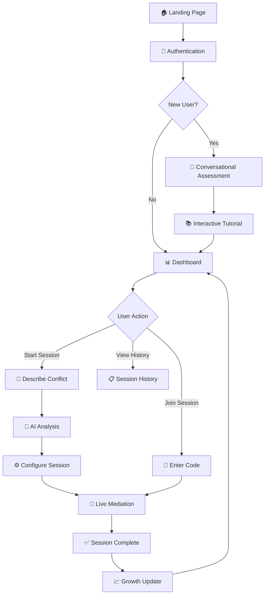
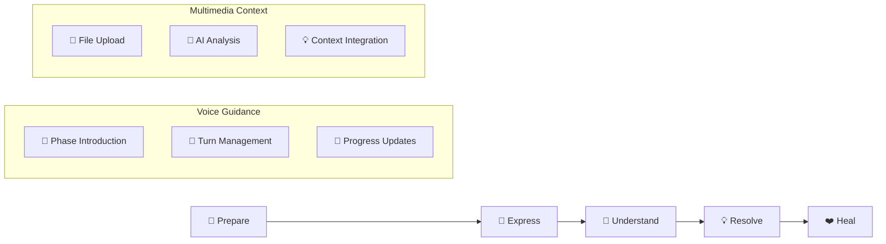
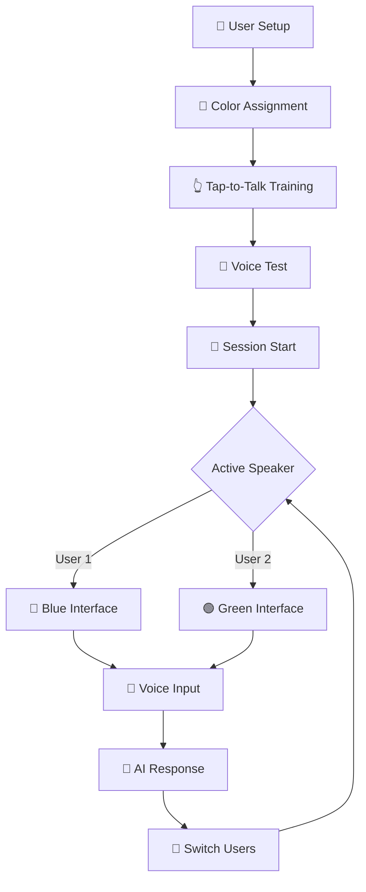

# Complete UX/UI Wireframes & Voice Agent Integration

## Overview
This document provides detailed, clear wireframes that exactly match the Mermaid flow diagram, with comprehensive voice agent guidance and multimedia context integration throughout the user journey.

## 🎯 Navigation Guide

### Quick Reference
- [🎤 Conversational Personality Assessment](#conversational-personality-assessment)
- [📱 Core User Interface Wireframes](#core-user-interface-wireframes)
- [🔄 Flow Diagrams & Visual Maps](#flow-diagrams--visual-maps)
- [🎵 Voice Agent Integration](#voice-agent-integration-principles)
- [📎 Multimedia Context Features](#multimedia-context-integration)

## Voice Agent Integration Principles

### AI Voice Agent Characteristics
- **Personality**: Warm, empathetic, professional mediator named "Alex"
- **Voice**: ElevenLabs synthesis with real-time emotional adaptation
- **Conversation Style**: Natural, flowing dialogue (not Q&A format)
- **Assessment Method**: Conversational analysis during natural discussion
- **Response Pattern**: Listen → Understand → Reflect → Guide

### Text-to-Speech Implementation
- **Trigger**: Every AI response is automatically spoken with natural pauses
- **Voice Settings**: Dynamic adaptation based on user's emotional state
- **Conversation Flow**: Seamless back-and-forth like talking to a friend
- **User Control**: Volume, speed, voice selection, pause/resume
- **Fallback**: Text display always available with conversation history

## 🎤 Conversational Personality Assessment

### Natural Conversation Flow (Replaces Traditional Q&A)

Instead of formal questionnaires, users engage in a natural 10-15 minute conversation with Alex (the AI mediator) that feels like talking to an understanding friend.

#### Conversation Structure

```
┌─────────────────────────────────────────────────────────────┐
│              🎤 Conversational Assessment                   │
│                "Getting to Know You"                       │
├─────────────────────────────────────────────────────────────┤
│  👋 Alex: "Hi there! I'm Alex, your AI mediator. I'm here │
│      to help you navigate conflicts with understanding     │
│      and care. Before we dive in, I'd love to get to      │
│      know you a bit. What brings you here today?"         │
│                                                             │
│  ┌─────────────────────────────────────────────────────┐   │
│  │ 🎤 User Response Area                               │   │
│  │ ┌─────────────────────────────────────────────────┐ │   │
│  │ │ [User speaks or types their response]           │ │   │
│  │ │ "I've been having some issues with my          │ │   │
│  │ │ coworker and I'm not sure how to handle it..."  │ │   │
│  │ └─────────────────────────────────────────────────┘ │   │
│  │                                                     │   │
│  │ ┌─────────────┐  ┌─────────────┐  ┌─────────────┐  │   │
│  │ │ 🎤 Speak    │  │ ⌨️ Type     │  │ 🔄 Restart  │  │   │
│  │ └─────────────┘  └─────────────┘  └─────────────┘  │   │
│  └─────────────────────────────────────────────────────┘   │
│                                                             │
│  🤖 Alex: "That sounds challenging. Workplace dynamics     │
│      can be really tricky to navigate. Tell me, when       │
│      conflicts come up in your life, what's your first     │
│      instinct? Do you tend to address things head-on,      │
│      or do you prefer to step back and think first?"       │
│                                                             │
│  ┌─────────────────────────────────────────────────────┐   │
│  │              🧠 AI Analysis (Hidden)                │   │
│  │  • Communication style: Reflective, seeks help     │   │
│  │  • Emotional state: Slightly anxious, uncertain    │   │
│  │  • Conflict approach: Avoidant tendencies          │   │
│  │  • Values: Harmony, professional relationships     │   │
│  └─────────────────────────────────────────────────────┘   │
│                                                             │
│  Progress: ████░░░░░░ 40% Complete                         │
│  🔊 Voice: Natural, warm, slightly slower pace             │
└─────────────────────────────────────────────────────────────┘
```

#### Conversation Topics & Natural Assessment Points

**1. Opening & Context (2-3 minutes)**
```
Alex: "What brings you here today?"
→ Assesses: Initial emotional state, communication openness, problem awareness

Alex: "That sounds like it's been weighing on you. How long has this been going on?"
→ Assesses: Temporal perspective, patience levels, stress tolerance
```

**2. Conflict Style Exploration (3-4 minutes)**
```
Alex: "When disagreements happen, what feels most natural to you?"
→ Assesses: Conflict approach (direct, avoidant, collaborative)

Alex: "Can you think of a time when you handled a disagreement really well? What made it work?"
→ Assesses: Self-awareness, learning ability, positive conflict experiences
```

**3. Communication Preferences (2-3 minutes)**
```
Alex: "Some people like to talk things through immediately, others need time to process. What works best for you?"
→ Assesses: Processing style, communication timing preferences

Alex: "When someone disagrees with you, what helps you feel heard and understood?"
→ Assesses: Validation needs, empathy requirements
```

**4. Values & Motivations (2-3 minutes)**
```
Alex: "What matters most to you in your relationships - whether personal or professional?"
→ Assesses: Core values, relationship priorities

Alex: "When you imagine the ideal resolution to a conflict, what does that look like?"
→ Assesses: Resolution goals, compromise willingness
```

**5. Emotional Processing (2-3 minutes)**
```
Alex: "How do you typically handle stress or strong emotions?"
→ Assesses: Emotional regulation, coping mechanisms

Alex: "Do you find it easier to express feelings in the moment, or do you prefer to process them privately first?"
→ Assesses: Emotional expression style, introversion/extroversion
```

#### Real-Time Analysis Interface (For Development/Testing)

```
┌─────────────────────────────────────────────────────────────┐
│              🔬 Live Personality Analysis                   │
│                  (Hidden from User)                        │
├─────────────────────────────────────────────────────────────┤
│  📊 Communication Style: Diplomatic (78% confidence)       │
│  🎯 Conflict Approach: Collaborative-Avoidant (82%)        │
│  💭 Processing Style: Reflective (85%)                     │
│  ❤️ Emotional Expression: Moderate-Internal (76%)          │
│  🤝 Relationship Values: Harmony-focused (91%)             │
│                                                             │
│  🎤 Voice Analysis:                                        │
│  • Tone: Slightly hesitant, seeking reassurance            │
│  • Pace: Measured, thoughtful pauses                       │
│  • Emotion: Mild anxiety, hopeful undertone                │
│                                                             │
│  📝 Language Patterns:                                     │
│  • Uses qualifying language ("I think", "maybe")           │
│  • Seeks validation ("Does that make sense?")              │
│  • Focuses on others' feelings                             │
│                                                             │
│  🎯 Recommended Mediation Approach:                        │
│  • Start with validation and reassurance                   │
│  • Allow processing time between phases                    │
│  • Focus on collaborative solutions                        │
│  • Emphasize relationship preservation                     │
└─────────────────────────────────────────────────────────────┘
```

#### Conversation Completion & Transition

```
┌─────────────────────────────────────────────────────────────┐
│              ✅ Assessment Complete                         │
├─────────────────────────────────────────────────────────────┤
│  🎤 Alex: "Thank you for sharing so openly with me. I feel │
│      like I have a much better understanding of how you    │
│      approach relationships and handle challenges.         │
│                                                             │
│      Based on our conversation, I can see that you value   │
│      harmony and thoughtful communication. You tend to     │
│      think things through carefully before acting, which   │
│      is a real strength in conflict resolution.            │
│                                                             │
│      I'm going to tailor my guidance style to work best    │
│      with your natural approach. Ready to dive into        │
│      helping you with that workplace situation?"           │
│                                                             │
│  ┌─────────────────────────────────────────────────────┐   │
│  │              🎯 Your Profile Summary                │   │
│  │                                                     │   │
│  │  Communication Style: Thoughtful Diplomat          │   │
│  │  Conflict Approach: Collaborative Problem-Solver   │   │
│  │  Strength: Considers all perspectives              │   │
│  │  Growth Area: Speaking up for your needs           │   │
│  │                                                     │   │
│  │  🎤 My Voice Adaptation:                           │   │
│  │  • Slower, more reassuring pace                    │   │
│  │  • Extra validation and encouragement              │   │
│  │  • Clear step-by-step guidance                     │   │
│  └─────────────────────────────────────────────────────┘   │
│                                                             │
│  ┌─────────────┐  ┌─────────────┐                         │
│  │ 🚀 Let's Go │  │ 📝 Review   │                         │
│  │             │  │   Profile   │                         │
│  └─────────────┘  └─────────────┘                         │
│                                                             │
│  🔊 Voice: Warm, encouraging, slightly excited             │
└─────────────────────────────────────────────────────────────┘
```

### Technical Implementation for Conversational Assessment

#### AI Conversation Manager
```typescript
class ConversationalAssessment {
  private conversation: ConversationTurn[] = []
  private analysis: PersonalityAnalysis = {}
  private currentTopic: AssessmentTopic = 'opening'

  async processUserResponse(input: string, audioData?: Blob): Promise<AIResponse> {
    // Analyze user input for personality indicators
    const analysis = await this.analyzeResponse(input, audioData)

    // Update personality profile
    this.updatePersonalityProfile(analysis)

    // Generate next conversation turn
    const nextResponse = await this.generateNextTurn()

    // Adapt voice based on user's style
    const voiceSettings = this.adaptVoiceToUser()

    return {
      text: nextResponse.text,
      voiceSettings,
      personalityUpdate: this.analysis,
      isComplete: this.isAssessmentComplete()
    }
  }

  private async analyzeResponse(input: string, audio?: Blob): Promise<ResponseAnalysis> {
    // Multi-modal analysis
    const textAnalysis = await this.analyzeTextContent(input)
    const voiceAnalysis = audio ? await this.analyzeVoicePatterns(audio) : null

    return {
      communicationStyle: textAnalysis.style,
      emotionalState: voiceAnalysis?.emotion || textAnalysis.emotion,
      conflictApproach: this.inferConflictStyle(input),
      values: this.extractValues(input),
      confidence: this.calculateConfidence(textAnalysis, voiceAnalysis)
    }
  }
}
```

## 🔄 Flow Diagrams & Visual Maps

### Main User Journey Overview



### Session Flow Detail



### Same-Device Interface Flow



## 📱 Core User Interface Wireframes

### 1. Enhanced Landing Page

```
┌─────────────────────────────────────────────────────────────┐
│                    🏠 UNDERSTAND.ME                        │
│                                                             │
│  ┌─────────────────────────────────────────────────────┐   │
│  │                 🎯 Hero Section                     │   │
│  │                                                     │   │
│  │  "Transform Conflicts into Understanding"          │   │
│  │  "with AI-Guided Voice Conversations"              │   │
│  │                                                     │   │
│  │  🎤 "Hi! I'm Alex, your AI mediator. I help       │   │
│  │      people work through conflicts with empathy    │   │
│  │      and understanding. Ready to get started?"     │   │
│  │                                                     │   │
│  │  ┌─────────────────┐  ┌─────────────────┐          │   │
│  │  │ 🚀 Start Free   │  │ 🎤 Hear Alex    │          │   │
│  │  │    Session      │  │    Speak        │          │   │
│  │  └─────────────────┘  └─────────────────┘          │   │
│  └─────────────────────────────────────────────────────┘   │
│                                                             │
│  ┌─────────────────────────────────────────────────────┐   │
│  │                🌟 Key Features                      │   │
│  │                                                     │   │
│  │  🎤 Natural Voice Conversations                     │   │
│  │  🤖 AI-Powered Conflict Analysis                    │   │
│  │  📎 Context-Aware File Integration                  │   │
│  │  👥 Same-Device & Remote Sessions                   │   │
│  │  📈 Personal Growth Tracking                        │   │
│  │  🔒 Private & Secure                               │   │
│  └─────────────────────────────────────────────────────┘   │
│                                                             │
│  ┌─────────────────────────────────────────────────────┐   │
│  │              💬 User Testimonials                   │   │
│  │                                                     │   │
│  │  "Alex helped us work through our biggest          │   │
│  │   disagreement in just one session. The voice      │   │
│  │   guidance made it feel like having a real         │   │
│  │   mediator in the room." - Sarah & Mike            │   │
│  │                                                     │   │
│  │  ⭐⭐⭐⭐⭐ 4.9/5 from 10,000+ sessions             │   │
│  └─────────────────────────────────────────────────────┘   │
│                                                             │
│  ┌─────────────────┐                                       │
│  │ 🔐 Get Started  │                                       │
│  └─────────────────┘                                       │
└─────────────────────────────────────────────────────────────┘
```

### 2. Streamlined Authentication

```
┌─────────────────────────────────────────────────────────────┐
│                  🔐 Welcome to Understand.me               │
├─────────────────────────────────────────────────────────────┤
│  🎤 Alex: "Welcome! I'm excited to meet you. Let's get     │
│      you set up so we can start our conversation."         │
│                                                             │
│  ┌─────────────────────────────────────────────────────┐   │
│  │                Quick Sign Up                        │   │
│  │                                                     │   │
│  │  📧 Email: ________________________________         │   │
│  │  👤 Name: _________________________________         │   │
│  │  🔒 Password: _____________________________         │   │
│  │                                                     │   │
│  │  ☑️ I agree to Terms & Privacy Policy              │   │
│  │                                                     │   │
│  │  ┌─────────────────┐                              │   │
│  │  │ 🚀 Start My     │                              │   │
│  │  │   Conversation  │                              │   │
│  │  └─────────────────┘                              │   │
│  │                                                     │   │
│  │  ────────── OR ──────────                          │   │
│  │                                                     │   │
│  │  ┌─────────────┐  ┌─────────────┐                 │   │
│  │  │ 🔵 Google   │  │ 🍎 Apple    │                 │   │
│  │  └─────────────┘  └─────────────┘                 │   │
│  │                                                     │   │
│  │  Already have an account? 🔑 Sign In               │   │
│  └─────────────────────────────────────────────────────┘   │
│                                                             │
│  🔊 Voice: Warm, welcoming, slightly excited               │
└─────────────────────────────────────────────────────────────┘
```

### 3. Conversational Assessment Interface (Improved)

```
┌─────────────────────────────────────────────────────────────┐
│              🎤 Getting to Know You - Alex                  │
│                                                             │
│  ┌─────────────────────────────────────────────────────┐   │
│  │                🤖 Alex (AI Mediator)                │   │
│  │                                                     │   │
│  │  [Animated avatar with gentle expressions]         │   │
│  │                                                     │   │
│  │  "Hi Sarah! I'm so glad you're here. I'd love to   │   │
│  │  get to know you a bit before we dive into helping │   │
│  │  with conflicts. Think of this as a friendly chat  │   │
│  │  with someone who really wants to understand you.  │   │
│  │                                                     │   │
│  │  What brings you to Understand.me today?"          │   │
│  └─────────────────────────────────────────────────────┘   │
│                                                             │
│  ┌─────────────────────────────────────────────────────┐   │
│  │              💬 Your Response                       │   │
│  │                                                     │   │
│  │  ┌─────────────────────────────────────────────────┐ │   │
│  │  │ 🎤 Tap to speak or type your response...       │ │   │
│  │  │                                                 │ │   │
│  │  │ [Live transcription appears here as you speak] │ │   │
│  │  │                                                 │ │   │
│  │  └─────────────────────────────────────────────────┘ │   │
│  │                                                     │   │
│  │  ┌─────────────┐  ┌─────────────┐  ┌─────────────┐  │   │
│  │  │ 🎤 Hold to  │  │ ⌨️ Type     │  │ 🔄 Start   │  │   │
│  │  │    Speak    │  │   Instead   │  │    Over     │  │   │
│  │  └─────────────┘  └─────────────┘  └─────────────┘  │   │
│  └─────────────────────────────────────────────────────┘   │
│                                                             │
│  ┌─────────────────────────────────────────────────────┐   │
│  │              📊 Conversation Progress               │   │
│  │                                                     │   │
│  │  Topics Covered: ████████░░ 80%                    │   │
│  │                                                     │   │
│  │  ✅ Your background & current situation            │   │
│  │  ✅ How you handle disagreements                   │   │
│  │  ✅ Communication preferences                      │   │
│  │  🔄 Values & relationship priorities               │   │
│  │  ⏳ Emotional processing style                     │   │
│  │                                                     │   │
│  │  Estimated time remaining: ~3 minutes              │   │
│  └─────────────────────────────────────────────────────┘   │
│                                                             │
│  ┌─────────────────────────────────────────────────────┐   │
│  │              🎯 Conversation Tips                   │   │
│  │                                                     │   │
│  │  💡 Speak naturally - there are no wrong answers   │   │
│  │  🎤 Alex adapts to your communication style        │   │
│  │  ⏸️ Take breaks anytime you need                   │   │
│  │  🔒 Everything is private and secure               │   │
│  └─────────────────────────────────────────────────────┘   │
│                                                             │
│  🔊 Voice: Natural conversation pace, warm and curious     │
└─────────────────────────────────────────────────────────────┘
```

### 4. Intelligent Dashboard

```
┌─────────────────────────────────────────────────────────────┐
│  👤 Sarah Johnson    🔔 2    ⚙️ Settings    🚪 Logout      │
├─────────────────────────────────────────────────────────────┤
│  🎤 Alex: "Welcome back, Sarah! I can see you've been      │
│      making great progress. How are you feeling today?"    │
│                                                             │
│  ┌─────────────────────────────────────────────────────┐   │
│  │              🚀 Quick Actions                       │   │
│  │                                                     │   │
│  │  ┌─────────────────┐  ┌─────────────────┐          │   │
│  │  │ 🎯 New Session  │  │ 🔗 Join Session │          │   │
│  │  │                 │  │                 │          │   │
│  │  │ Start fresh     │  │ Enter code      │          │   │
│  │  │ conflict        │  │ to join         │          │   │
│  │  │ resolution      │  │ existing        │          │   │
│  │  └─────────────────┘  └─────────────────┘          │   │
│  │                                                     │   │
│  │  ┌─────────────────┐  ┌─────────────────┐          │   │
│  │  │ 📚 My Sessions  │  │ 📈 Growth Hub   │          │   │
│  │  │                 │  │                 │          │   │
│  │  │ View history    │  │ Track progress  │          │   │
│  │  │ and insights    │  │ and insights    │          │   │
│  │  └─────────────────┘  └─────────────────┘          │   │
│  └─────────────────────────────────────────────────────┘   │
│                                                             │
│  ┌─────────────────────────────────────────────────────┐   │
│  │              📊 Your Progress Today                 │   │
│  │                                                     │   │
│  │  🎯 Communication Style: Thoughtful Diplomat       │   │
│  │  📈 Sessions Completed: 3 this month               │   │
│  │  🏆 Latest Achievement: "Active Listener" badge    │   │
│  │  💡 Growth Focus: Speaking up for your needs       │   │
│  │                                                     │   │
│  │  ┌─────────────────┐                              │   │
│  │  │ 📊 View Full    │                              │   │
│  │  │    Analytics    │                              │   │
│  │  └─────────────────┘                              │   │
│  └─────────────────────────────────────────────────────┘   │
│                                                             │
│  ┌─────────────────────────────────────────────────────┐   │
│  │              🔄 Active & Recent                     │   │
│  │                                                     │   │
│  │  📅 Team Meeting Conflict - In Progress            │   │
│  │  👥 You & Mike • Phase: Understand                 │   │
│  │  ⏱️ Started 2 hours ago                            │   │
│  │  ┌─────────────┐  ┌─────────────┐                 │   │
│  │  │ 🔄 Resume   │  │ 👁️ Review   │                 │   │
│  │  └─────────────┘  └─────────────┘                 │   │
│  │                                                     │   │
│  │  📅 Family Discussion - Completed ✅               │   │
│  │  👥 You & Mom • Resolved yesterday                 │   │
│  │  💡 "Great progress on listening skills!"          │   │
│  │  ┌─────────────┐                                  │   │
│  │  │ 📋 View     │                                  │   │
│  │  │   Summary   │                                  │   │
│  │  └─────────────┘                                  │   │
│  └─────────────────────────────────────────────────────┘   │
│                                                             │
│  ┌─────────────────────────────────────────────────────┐   │
│  │              💡 Alex's Suggestions                  │   │
│  │                                                     │   │
│  │  🎤 "Based on your recent sessions, I notice       │   │
│  │      you're getting better at understanding        │   │
│  │      others' perspectives. Ready to work on        │   │
│  │      expressing your own needs more clearly?"      │   │
│  │                                                     │   │
│  │  ┌─────────────────┐  ┌─────────────────┐          │   │
│  │  │ 🎯 Practice     │  │ 📚 Learn More   │          │   │
│  │  │   Session       │  │   About This    │          │   │
│  │  └─────────────────┘  └─────────────────┘          │   │
│  └─────────────────────────────────────────────────────┘   │
│                                                             │
│  🔊 Voice: Encouraging, personalized, celebrates progress  │
└─────────────────────────────────────────────────────────────┘
```

### 5. Enhanced Conflict Description Interface

```
┌─────────────────────────────────────────────────────────────┐
│              📝 Tell Alex About Your Situation              │
├─────────────────────────────────────────────────────────────┤
│  🎤 Alex: "I'm here to listen and understand. Take your    │
│      time and share what's happening. You can speak        │
│      naturally, upload any relevant files, or type -       │
│      whatever feels most comfortable for you."             │
│                                                             │
│  ┌─────────────────────────────────────────────────────┐   │
│  │              💬 Share Your Story                    │   │
│  │                                                     │   │
│  │  ┌─────────────────────────────────────────────────┐ │   │
│  │  │ 🎤 Speak or type about your situation...       │ │   │
│  │  │                                                 │ │   │
│  │  │ [Live transcription and text input area]       │ │   │
│  │  │                                                 │ │   │
│  │  │ "I've been having ongoing issues with my       │ │   │
│  │  │ coworker Mike about project deadlines. It      │ │   │
│  │  │ started three weeks ago when..."                │ │   │
│  │  └─────────────────────────────────────────────────┘ │   │
│  │                                                     │   │
│  │  ┌─────────────┐  ┌─────────────┐  ┌─────────────┐  │   │
│  │  │ 🎤 Voice    │  │ ⌨️ Type     │  │ 🔄 Clear   │  │   │
│  │  │   Input     │  │   Instead   │  │   & Start  │  │   │
│  │  └─────────────┘  └─────────────┘  └─────────────┘  │   │
│  └─────────────────────────────────────────────────────┘   │
│                                                             │
│  ┌─────────────────────────────────────────────────────┐   │
│  │              📎 Add Context (Optional)              │   │
│  │                                                     │   │
│  │  Drag & drop or click to add supporting materials  │   │
│  │                                                     │   │
│  │  ┌─────┐ ┌─────┐ ┌─────┐ ┌─────┐ ┌─────┐          │   │
│  │  │ 📷  │ │ 📄  │ │ 📧  │ │ 🎥  │ │ 🎵  │          │   │
│  │  │Photo│ │ Doc │ │Email│ │Video│ │Audio│          │   │
│  │  └─────┘ └─────┘ └─────┘ └─────┘ └─────┘          │   │
│  │                                                     │   │
│  │  📷 meeting_photo.jpg ✅ Uploaded                  │   │
│  │  🤖 "I can see tension in the body language.       │   │
│  │      This helps me understand the dynamics."       │   │
│  │                                                     │   │
│  │  📧 email_thread.pdf ✅ Uploaded                   │   │
│  │  🤖 "The email escalation pattern shows the        │   │
│  │      conflict building over 3 weeks."              │   │
│  └─────────────────────────────────────────────────────┘   │
│                                                             │
│  ┌─────────────────────────────────────────────────────┐   │
│  │              🎯 Alex's Real-Time Insights           │   │
│  │                                                     │   │
│  │  🎤 "I can hear this has been really frustrating   │   │
│  │      for you. The photos and emails help me see    │   │
│  │      how this built up over time. It sounds like   │   │
│  │      both you and Mike care about the project's    │   │
│  │      success - that's a great foundation to        │   │
│  │      build on."                                     │   │
│  │                                                     │   │
│  │  💡 Detected: Workplace conflict, communication    │   │
│  │      breakdown, shared goals                       │   │
│  └─────────────────────────────────────────────────────┘   │
│                                                             │
│  ┌─────────────┐                                           │
│  │ ➡️ Continue │                                           │
│  │   with Alex │                                           │
│  └─────────────┘                                           │
│                                                             │
│  🔊 Voice: Empathetic, patient, encouraging                │
└─────────────────────────────────────────────────────────────┘
```

### 6. AI Analysis & Understanding Confirmation

```
┌─────────────────────────────────────────────────────────────┐
│              🤖 Alex's Understanding & Analysis             │
├─────────────────────────────────────────────────────────────┤
│  🎤 Alex: "Thank you for sharing so openly. Let me tell    │
│      you what I understand about your situation, and       │
│      please let me know if I've got anything wrong."       │
│                                                             │
│  ┌─────────────────────────────────────────────────────┐   │
│  │              📊 What I See                          │   │
│  │                                                     │   │
│  │  🎯 Conflict Type: Workplace Communication          │   │
│  │  📈 Intensity Level: Medium (6/10)                 │   │
│  │  ⏱️ Duration: 3 weeks and escalating               │   │
│  │  👥 People Involved: You and Mike                  │   │
│  │                                                     │   │
│  │  🔍 Core Issues I've Identified:                   │   │
│  │  • Different approaches to deadline management     │   │
│  │  • Lack of clear communication about expectations  │   │
│  │  • Stress from external project pressures          │   │
│  │  • Both parties feeling unheard                    │   │
│  │                                                     │   │
│  │  💪 Strengths I Notice:                            │   │
│  │  • Both care deeply about project success          │   │
│  │  • History of good collaboration                   │   │
│  │  • You're seeking resolution (shows maturity)      │   │
│  │  • Willingness to examine your own role            │   │
│  └─────────────────────────────────────────────────────┘   │
│                                                             │
│  ┌─────────────────────────────────────────────────────┐   │
│  │              📎 Evidence from Your Files            │   │
│  │                                                     │   │
│  │  📷 Meeting Photo Analysis:                        │   │
│  │  "Body language shows both parties feeling         │   │
│  │  defensive. Mike appears overwhelmed, you appear   │   │
│  │  frustrated but trying to stay professional."      │   │
│  │                                                     │   │
│  │  📧 Email Thread Analysis:                         │   │
│  │  "Shows escalating tension over 3 weeks. Key       │   │
│  │  turning point was the deadline change on March    │   │
│  │  15th. Both parties using increasingly formal      │   │
│  │  language - a sign of growing distance."           │   │
│  └─────────────────────────────────────────────────────┘   │
│                                                             │
│  ┌─────────────────────────────────────────────────────┐   │
│  │              🎯 My Recommended Approach             │   │
│  │                                                     │   │
│  │  🤝 Style: Collaborative Problem-Solving           │   │
│  │  🎯 Focus: Understanding perspectives first        │   │
│  │  ⏱️ Estimated Sessions: 2-3 sessions               │   │
│  │  🎤 My Voice Approach: Patient, validating         │   │
│  │                                                     │   │
│  │  📋 Session Plan:                                  │   │
│  │  1. Individual perspective sharing                 │   │
│  │  2. Understanding each other's pressures           │   │
│  │  3. Finding shared solutions                       │   │
│  │  4. Creating better communication patterns         │   │
│  └─────────────────────────────────────────────────────┘   │
│                                                             │
│  🎤 Alex: "Does this feel accurate to you? Is there       │
│      anything important I'm missing or misunderstanding?"  │
│                                                             │
│  ┌─────────────┐  ┌─────────────┐  ┌─────────────┐        │
│  │ ✅ Looks    │  │ ✏️ Let Me   │  │ 🔄 Analyze  │        │
│  │   Perfect   │  │   Clarify   │  │   Again     │        │
│  └─────────────┘  └─────────────┘  └─────────────┘        │
│                                                             │
│  🔊 Voice: Thoughtful, seeking confirmation, collaborative │
└─────────────────────────────────────────────────────────────┘
```

### 1. Landing Page (Mermaid: A)
```
┌─────────────────────────────────────────────────────────────┐
│                    UNDERSTAND.ME                           │
├─────────────────────────────────────────────────────────────┤
│  🎯 AI-Mediated Conflict Resolution Platform               │
│                                                             │
│  "Transform conflicts into understanding with AI guidance"  │
│                                                             │
│  ┌─────────────────┐  ┌─────────────────┐                 │
│  │ 🚀 Get Started  │  │ 📖 Learn More   │                 │
│  └─────────────────┘  └─────────────────┘                 │
│                                                             │
│  ✓ AI-Powered Mediation  ✓ Voice Guidance  ✓ Private      │
│  ✓ Real-time Sessions   ✓ Growth Tracking  ✓ Secure       │
│                                                             │
│  🎤 "Welcome to Understand.me. I'm your AI mediator,       │
│      here to guide you through conflict resolution         │
│      with empathy and expertise."                          │
└─────────────────────────────────────────────────────────────┘
```

**Voice Agent Introduction:**
- **Trigger**: Page load
- **Message**: "Welcome to Understand.me. I'm your AI mediator, ready to help you transform conflicts into understanding. Would you like to get started or learn more about how I can help?"
- **TTS**: Warm, welcoming tone

### 2. Authentication Flow (Mermaid: B → C)
```
┌─────────────────────────────────────────────────────────────┐
│                    Sign Up / Login                         │
├─────────────────────────────────────────────────────────────┤
│  🎤 "Let's get you set up so I can provide personalized    │
│      guidance for your conflict resolution journey."       │
│                                                             │
│  ┌─────────────────────────────────────────────────────┐   │
│  │ 📧 Email: ________________________                 │   │
│  │ 🔒 Password: ____________________                  │   │
│  │                                                     │   │
│  │ ┌─────────────┐  ┌─────────────┐                  │   │
│  │ │ 📝 Sign Up  │  │ 🔑 Login    │                  │   │
│  │ └─────────────┘  └─────────────┘                  │   │
│  │                                                     │   │
│  │ ── OR ──                                           │   │
│  │                                                     │   │
│  │ ┌─────────────┐  ┌─────────────┐                  │   │
│  │ │ 🔵 Google   │  │ 🍎 Apple    │                  │   │
│  │ └─────────────┘  └─────────────┘                  │   │
│  └─────────────────────────────────────────────────────┘   │
│                                                             │
│  🔊 Voice Feedback: "Great! Now I can remember your        │
│      preferences and track your progress."                 │
└─────────────────────────────────────────────────────────────┘
```

**Voice Agent Guidance:**
- **New User**: "I'll guide you through a quick setup to understand how you communicate and handle conflicts."
- **Returning User**: "Welcome back! I remember your preferences. What would you like to work on today?"

### 3. AI-Powered Onboarding (Mermaid: D → E → F)

#### 3.1 Personality Assessment (Mermaid: E)
```
┌─────────────────────────────────────────────────────────────┐
│              Personality Assessment (Question 3/15)        │
├─────────────────────────────────────────────────────────────┤
│  🎤 "This helps me understand your communication style      │
│      so I can provide the most effective guidance."        │
│                                                             │
│  Progress: ████████░░░░░░░░ 40%                            │
│                                                             │
│  Question: "When facing a disagreement, you typically:"    │
│                                                             │
│  ┌─────────────────────────────────────────────────────┐   │
│  │ ○ Address it immediately and directly               │   │
│  │ ○ Take time to think before responding              │   │
│  │ ○ Try to find common ground first                   │   │
│  │ ○ Avoid confrontation when possible                 │   │
│  └─────────────────────────────────────────────────────┘   │
│                                                             │
│  ┌─────────────┐  ┌─────────────┐  ┌─────────────┐        │
│  │ ⬅️ Previous │  │ ⏭️ Skip     │  │ ➡️ Next     │        │
│  └─────────────┘  └─────────────┘  └─────────────┘        │
│                                                             │
│  🔊 "Take your time. There are no right or wrong answers." │
└─────────────────────────────────────────────────────────────┘
```

**Voice Agent for Each Question:**
- **Question Introduction**: Explains why the question matters
- **Encouragement**: "Take your time, there are no wrong answers"
- **Progress Updates**: "Great progress! Just X more questions to go"

#### 3.2 Platform Tutorial (Mermaid: F)
```
┌─────────────────────────────────────────────────────────────┐
│                    Platform Tutorial                       │
├─────────────────────────────────────────────────────────────┤
│  🎤 "Let me show you how our sessions work. I'll be your   │
│      guide throughout every step of the process."          │
│                                                             │
│  ┌─────────────────────────────────────────────────────┐   │
│  │                                                     │   │
│  │    [Interactive Demo of Session Interface]         │   │
│  │                                                     │   │
│  │  🎯 Five Phases: Prepare → Express → Understand    │   │
│  │                 → Resolve → Heal                   │   │
│  │                                                     │   │
│  │  🎤 Voice Guidance Available Throughout            │   │
│  │  📎 File Upload for Context                        │   │
│  │  👥 Same-Device or Remote Sessions                 │   │
│  │                                                     │   │
│  └─────────────────────────────────────────────────────┘   │
│                                                             │
│  ┌─────────────┐  ┌─────────────┐                         │
│  │ 🔄 Replay   │  │ ✅ Got It   │                         │
│  └─────────────┘  └─────────────┘                         │
│                                                             │
│  🔊 "You're all set! Ready to start your first session?"  │
└─────────────────────────────────────────────────────────────┘
```

### 4. Main Dashboard (Mermaid: G/H)
```
┌─────────────────────────────────────────────────────────────┐
│  👤 Sarah Johnson    🔔 2    ⚙️ Settings    🚪 Logout      │
├─────────────────────────────────────────────────────────────┤
│  🎤 "Welcome back, Sarah. How can I help you today?"       │
│                                                             │
│  ┌─────────────────────────────────────────────────────┐   │
│  │                Quick Actions                        │   │
│  │  ┌─────────────────┐  ┌─────────────────┐          │   │
│  │  │ 🚀 Start New    │  │ 🔗 Join Session │          │   │
│  │  │    Session      │  │                 │          │   │
│  │  └─────────────────┘  └─────────────────┘          │   │
│  │                                                     │   │
│  │  ┌─────────────────┐  ┌─────────────────┐          │   │
│  │  │ 📚 Session      │  │ 📈 Growth       │          │   │
│  │  │    History      │  │    Dashboard    │          │   │
│  │  └─────────────────┘  └─────────────────┘          │   │
│  └─────────────────────────────────────────────────────┘   │
│                                                             │
│  ┌─────────────────────────────────────────────────────┐   │
│  │                Active Sessions                      │   │
│  │  📅 Team Meeting Conflict - In Progress            │   │
│  │  👥 2 participants • Phase: Express                │   │
│  │  ┌─────────────┐  ┌─────────────┐                 │   │
│  │  │ 🔄 Resume   │  │ 👁️ View     │                 │   │
│  │  └─────────────┘  └─────────────┘                 │   │
│  └─────────────────────────────────────────────────────┘   │
│                                                             │
│  🔊 Voice Options: [🔇 Mute] [🔊 Volume] [⚙️ Voice Settings] │
└─────────────────────────────────────────────────────────────┘
```

**Voice Agent Dashboard Guidance:**
- **Welcome Message**: Personalized greeting with user's name
- **Action Suggestions**: "I see you have an active session. Would you like to resume, or start something new?"
- **Progress Updates**: "You've completed 3 sessions this month. Great progress!"

### 5. Host Flow - Conflict Description (Mermaid: O)
```
┌─────────────────────────────────────────────────────────────┐
│                  Describe Your Conflict                    │
├─────────────────────────────────────────────────────────────┤
│  🎤 "I'm here to help you work through this. Please share  │
│      what's happening, and feel free to include any        │
│      documents or images that provide context."            │
│                                                             │
│  ┌─────────────────────────────────────────────────────┐   │
│  │ 📝 Conflict Description                             │   │
│  │ ┌─────────────────────────────────────────────────┐ │   │
│  │ │ Tell me about the situation you're facing...    │ │   │
│  │ │                                                 │ │   │
│  │ │                                                 │ │   │
│  │ │                                                 │ │   │
│  │ └─────────────────────────────────────────────────┘ │   │
│  │                                                     │   │
│  │ ┌─────────────┐  ┌─────────────┐                  │   │
│  │ │ 🎤 Voice    │  │ 📎 Add Files │                  │   │
│  │ │    Input    │  │             │                  │   │
│  │ └─────────────┘  └─────────────┘                  │   │
│  └─────────────────────────────────────────────────────┘   │
│                                                             │
│  ┌─────────────────────────────────────────────────────┐   │
│  │              📎 Context Files                       │   │
│  │  ┌─────┐ ┌─────┐ ┌─────┐ ┌─────┐                  │   │
│  │  │ 📷  │ │ 📄  │ │ 🎥  │ │ 🎵  │                  │   │
│  │  │Image│ │ Doc │ │Video│ │Audio│                  │   │
│  │  └─────┘ └─────┘ └─────┘ └─────┘                  │   │
│  │                                                     │   │
│  │  Drag & drop files or click to browse              │   │
│  │                                                     │   │
│  │  📷 meeting_screenshot.png                         │   │
│  │  🤖 AI Analysis: "Shows tense body language        │   │
│  │      and crossed arms, suggesting defensiveness"   │   │
│  │  ┌─────────────┐  ┌─────────────┐                 │   │
│  │  │ 👁️ View     │  │ 🗑️ Remove   │                 │   │
│  │  └─────────────┘  └─────────────┘                 │   │
│  └─────────────────────────────────────────────────────┘   │
│                                                             │
│  ┌─────────────┐                                           │
│  │ ➡️ Continue │                                           │
│  └─────────────┘                                           │
│                                                             │
│  🔊 "I can see this is important to you. The more context  │
│      you provide, the better I can help guide the process."│
└─────────────────────────────────────────────────────────────┘
```

**Voice Agent Guidance for Conflict Description:**
- **Initial Prompt**: "Take your time to describe what's happening. I'm here to listen without judgment."
- **File Upload Encouragement**: "If you have any emails, photos, or documents that show what happened, feel free to add them."
- **AI Analysis Explanation**: "I've analyzed your image and can see [specific observations]. This helps me understand the situation better."
- **Emotional Support**: "I can hear this is difficult for you. You're taking a positive step by seeking resolution."

### 6. AI Problem Analysis Review (Mermaid: Q → R)
```
┌─────────────────────────────────────────────────────────────┐
│                   AI Analysis Summary                       │
├─────────────────────────────────────────────────────────────┤
│  🎤 "I've analyzed your situation and supporting materials. │
│      Here's what I understand, and you can edit anything   │
│      that doesn't feel accurate."                          │
│                                                             │
│  ┌─────────────────────────────────────────────────────┐   │
│  │                 📊 Conflict Analysis                │   │
│  │                                                     │   │
│  │  🎯 Type: Workplace Communication                  │   │
│  │  📈 Intensity: Medium (6/10)                       │   │
│  │  ⏱️ Estimated Sessions: 2-3                        │   │
│  │                                                     │   │
│  │  🔍 Key Issues Identified:                         │   │
│  │  • Miscommunication about project deadlines       │   │
│  │  • Different work style preferences                │   │
│  │  • Lack of clear role boundaries                   │   │
│  │                                                     │   │
│  │  💪 Strengths to Build On:                         │   │
│  │  • Both parties want project success               │   │
│  │  • History of good collaboration                   │   │
│  │  • Willingness to seek resolution                  │   │
│  │                                                     │   │
│  │  🎯 Recommended Approach: Facilitative            │   │
│  │  Focus on understanding perspectives and           │   │
│  │  finding mutually acceptable solutions             │   │
│  └─────────────────────────────────────────────────────┘   │
│                                                             │
│  ┌─────────────────────────────────────────────────────┐   │
│  │              📎 File Insights                       │   │
│  │  📷 meeting_screenshot.png                         │   │
│  │  💡 "Body language suggests both parties feel      │   │
│  │      unheard. Recommend starting with individual   │   │
│  │      perspective sharing before joint discussion." │   │
│  └─────────────────────────────────────────────────────┘   │
│                                                             │
│  ┌─────────────┐  ┌─────────────┐  ┌─────────────┐        │
│  │ ✏️ Edit     │  │ 🔄 Reanalyze│  │ ✅ Looks Good│        │
│  └─────────────┘  └─────────────┘  └─────────────┘        │
│                                                             │
│  🔊 "Does this summary capture your situation accurately?   │
│      I can adjust my understanding if needed."             │
└─────────────────────────────────────────────────────────────┘
```

**Voice Agent Analysis Explanation:**
- **Summary Introduction**: "Based on what you've shared, here's my understanding of the situation."
- **Key Points Emphasis**: "The main issues I see are... and your strengths include..."
- **File Integration**: "The image you shared shows... which helps me understand the dynamics."
- **Accuracy Check**: "Does this feel accurate to you? I can adjust my analysis if anything seems off."

### 7. Session Configuration (Mermaid: S → T)
```
┌─────────────────────────────────────────────────────────────┐
│                  Configure Your Session                    │
├─────────────────────────────────────────────────────────────┤
│  🎤 "Now let's set up how you'd like to run this session.  │
│      I can guide you through different options based on    │
│      your situation."                                      │
│                                                             │
│  ┌─────────────────────────────────────────────────────┐   │
│  │                Session Type                         │   │
│  │                                                     │   │
│  │  ○ 💻 Joint Remote Session                         │   │
│  │    Multiple participants, separate devices          │   │
│  │    Best for: Distributed teams, family members     │   │
│  │                                                     │   │
│  │  ● 👥 Joint Same-Device Session                    │   │
│  │    Multiple participants, shared screen            │   │
│  │    Best for: Couples, roommates, in-person teams   │   │
│  │                                                     │   │
│  │  ○ 🎯 Individual Session                           │   │
│  │    Solo coaching and preparation                   │   │
│  │    Best for: Self-reflection, preparation          │   │
│  └─────────────────────────────────────────────────────┘   │
│                                                             │
│  ┌─────────────────────────────────────────────────────┐   │
│  │              Session Settings                       │   │
│  │  ⏱️ Duration: ○ 30min ● 45min ○ 60min ○ Custom    │   │
│  │  🔒 Privacy: ● Private ○ Allow Recording           │   │
│  │  🎤 Voice: ● AI Guidance ○ Text Only               │   │
│  │  📱 Notifications: ● Enabled ○ Disabled            │   │
│  └─────────────────────────────────────────────────────┘   │
│                                                             │
│  ┌─────────────┐  ┌─────────────┐                         │
│  │ ⬅️ Back     │  │ ➡️ Continue │                         │
│  └─────────────┘  └─────────────┘                         │
│                                                             │
│  🔊 "Same-device sessions work well when you're together   │
│      physically. I'll help manage turn-taking fairly."    │
└─────────────────────────────────────────────────────────────┘
```

### 8. Same-Device Setup (Mermaid: V → AN → AO → AP)
```
┌─────────────────────────────────────────────────────────────┐
│                Same-Device Session Setup                   │
├─────────────────────────────────────────────────────────────┤
│  🎤 "Perfect! Let's set up your shared session. I'll help  │
│      each person identify themselves and understand their  │
│      communication style."                                 │
│                                                             │
│  ┌─────────────────────────────────────────────────────┐   │
│  │              User Identification                    │   │
│  │                                                     │   │
│  │  👤 User 1: Sarah (Host)                           │   │
│  │  🎨 Color: 🔵 Blue                                 │   │
│  │  ✅ Assessment Complete                             │   │
│  │                                                     │   │
│  │  👤 User 2: Mike                                   │   │
│  │  🎨 Color: 🟢 Green                                │   │
│  │  ⏳ Assessment Needed                              │   │
│  │                                                     │   │
│  │  ┌─────────────────┐                              │   │
│  │  │ ➕ Add User 3   │  (Max 4 users)               │   │
│  │  └─────────────────┘                              │   │
│  └─────────────────────────────────────────────────────┘   │
│                                                             │
│  ┌─────────────────────────────────────────────────────┐   │
│  │            Quick Assessment for Mike                │   │
│  │                                                     │   │
│  │  🎤 "Hi Mike! I need to understand your            │   │
│  │      communication style. This will just take      │   │
│  │      2-3 minutes."                                 │   │
│  │                                                     │   │
│  │  Question 1/5: "When you disagree, you prefer to:" │   │
│  │  ○ Discuss immediately                             │   │
│  │  ○ Think it over first                             │   │
│  │  ○ Find compromise                                 │   │
│  │  ○ Avoid conflict                                  │   │
│  │                                                     │   │
│  │  ┌─────────────┐  ┌─────────────┐                 │   │
│  │  │ ⏭️ Skip     │  │ ➡️ Next     │                 │   │
│  │  └─────────────┘  └─────────────┘                 │   │
│  └─────────────────────────────────────────────────────┘   │
│                                                             │
│  🔊 "Once everyone's set up, I'll guide you through        │
│      the session with clear turn-taking."                  │
└─────────────────────────────────────────────────────────────┘
```

### 9. Five-Phase Mediation Session (Mermaid: AW → AX → AY → BC → BD → BE)

#### 9.1 Phase 1: Prepare (Mermaid: AX)
```
┌─────────────────────────────────────────────────────────────┐
│  Session: Workplace Conflict • Phase 1: Prepare (1/5)      │
│  👥 Sarah & Mike • ⏱️ 45:00 • 🎤 AI Guidance Active       │
├─────────────────────────────────────────────────────────────┤
│  🎤 "Welcome to your mediation session. I'm here to guide  │
│      you both toward understanding and resolution. Let's   │
│      start by establishing our goals and ground rules."    │
│                                                             │
│  ┌─────────────────────────────────────────────────────┐   │
│  │                🎯 Session Goals                     │   │
│  │  ✓ Understand each other's perspectives            │   │
│  │  ✓ Clarify project roles and responsibilities      │   │
│  │  ✓ Establish better communication patterns         │   │
│  │  ✓ Create action plan for moving forward           │   │
│  └─────────────────────────────────────────────────────┘   │
│                                                             │
│  ┌─────────────────────────────────────────────────────┐   │
│  │                📋 Ground Rules                      │   │
│  │  ✓ Listen without interrupting                     │   │
│  │  ✓ Speak from your own experience                  │   │
│  │  ✓ Focus on solutions, not blame                   │   │
│  │  ✓ Respect each other's perspectives               │   │
│  │  ✓ Take breaks if emotions run high                │   │
│  └─────────────────────────────────────────────────────┘   │
│                                                             │
│  ┌─────────────────────────────────────────────────────┐   │
│  │              👥 Participant Agreement               │   │
│  │                                                     │   │
│  │  🔵 Sarah: ✅ I agree to these terms               │   │
│  │  🟢 Mike:  ⏳ Waiting for response                 │   │
│  │                                                     │   │
│  │  ┌─────────────┐  ┌─────────────┐                 │   │
│  │  │ ✅ I Agree  │  │ ❓ Questions │                 │   │
│  │  └─────────────┘  └─────────────┘                 │   │
│  └─────────────────────────────────────────────────────┘   │
│                                                             │
│  🔊 "Great! Now that we're aligned, let's move to the      │
│      Express phase where each of you can share your story."│
└─────────────────────────────────────────────────────────────┘
```

#### 9.2 Phase 2: Express (Mermaid: AY → BA/BB)
```
┌─────────────────────────────────────────────────────────────┐
│  Session: Workplace Conflict • Phase 2: Express (2/5)      │
│  👥 Sarah & Mike • ⏱️ 38:45 • 🎤 AI Guidance Active       │
├─────────────────────────────────────────────────────────────┤
│  🎤 "Now it's time for each of you to share your           │
│      perspective. Sarah, as the host, would you like       │
│      to start? Mike will have equal time to respond."      │
│                                                             │
│  ┌─────────────────────────────────────────────────────┐   │
│  │              👥 Turn Management                     │   │
│  │                                                     │   │
│  │  🔵 SARAH (ACTIVE) ────────── 🟢 MIKE (WAITING)    │   │
│  │  ┌─────────────────┐         ┌─────────────────┐   │   │
│  │  │   🎤 SPEAKING   │         │   👂 LISTENING  │   │   │
│  │  │   ⏱️ 3:45 used  │         │   ⏱️ 5:00 left  │   │   │
│  │  └─────────────────┘         └─────────────────┘   │   │
│  │                                                     │   │
│  │  ┌─────────────┐  ┌─────────────┐                 │   │
│  │  │ 🔄 Switch   │  │ ⏸️ Pause    │                 │   │
│  │  │   Users     │  │   Session   │                 │   │
│  │  └─────────────┘  └─────────────┘                 │   │
│  └─────────────────────────────────────────────────────┘   │
│                                                             │
│  ┌─────────────────────────────────────────────────────┐   │
│  │                💬 Current Input                     │   │
│  │  ┌─────────────────────────────────────────────────┐ │   │
│  │  │ I feel like the project deadlines were set     │ │   │
│  │  │ without considering our current workload...     │ │   │
│  │  └─────────────────────────────────────────────────┘ │   │
│  │                                                     │   │
│  │  ┌─────────────┐ ┌─────────────┐ ┌─────────────┐  │   │
│  │  │ 🎤 Voice    │ │ 📎 Add File │ │ ➤ Send      │  │   │
│  │  └─────────────┘ └─────────────┘ └─────────────┘  │   │
│  └─────────────────────────────────────────────────────┘   │
│                                                             │
│  ┌─────────────────────────────────────────────────────┐   │
│  │              📎 Context Files Available             │   │
│  │  📄 project_timeline.pdf                           │   │
│  │  📷 meeting_screenshot.png                         │   │
│  │  💡 "Reference these anytime for context"          │   │
│  └─────────────────────────────────────────────────────┘   │
│                                                             │
│  🔊 "Sarah, I can hear the frustration in your voice.      │
│      Take your time to fully express your perspective."    │
└─────────────────────────────────────────────────────────────┘
```

#### 9.3 Phase 3: Understand (Mermaid: BC)
```
┌─────────────────────────────────────────────────────────────┐
│  Session: Workplace Conflict • Phase 3: Understand (3/5)   │
│  👥 Sarah & Mike • ⏱️ 28:30 • 🎤 AI Guidance Active       │
├─────────────────────────────────────────────────────────────┤
│  🎤 "I've heard both perspectives. Now let's work on       │
│      understanding each other's viewpoints. I'll help      │
│      you see the situation through each other's eyes."     │
│                                                             │
│  ┌─────────────────────────────────────────────────────┐   │
│  │              🔍 Perspective Mapping                 │   │
│  │                                                     │   │
│  │  🔵 Sarah's View:                                  │   │
│  │  • Feels overwhelmed by unrealistic deadlines      │   │
│  │  • Wants more input in planning process            │   │
│  │  • Values quality over speed                       │   │
│  │                                                     │   │
│  │  🟢 Mike's View:                                   │   │
│  │  • Under pressure from management                  │   │
│  │  • Trying to balance multiple priorities           │   │
│  │  • Wants to maintain team efficiency               │   │
│  │                                                     │   │
│  │  🤝 Common Ground:                                 │   │
│  │  • Both want project success                       │   │
│  │  • Both feel stressed about timeline               │   │
│  │  • Both value team collaboration                   │   │
│  └─────────────────────────────────────────────────────┘   │
│                                                             │
│  ┌─────────────────────────────────────────────────────┐   │
│  │              💡 AI Insights                         │   │
│  │  "Based on your conversation and the meeting       │   │
│  │  photo, I notice both of you are experiencing      │   │
│  │  similar pressures but expressing them differently. │   │
│  │  Sarah, can you see how Mike might feel caught     │   │
│  │  between management and the team?"                  │   │
│  └─────────────────────────────────────────────────────┘   │
│                                                             │
│  ┌─────────────────────────────────────────────────────┐   │
│  │              🎯 Understanding Check                 │   │
│  │                                                     │   │
│  │  🔵 Sarah: "I can see Mike is under pressure too"  │   │
│  │  🟢 Mike: "I understand Sarah needs more input"    │   │
│  │                                                     │   │
│  │  ┌─────────────┐  ┌─────────────┐                 │   │
│  │  │ ✅ Ready to │  │ 🔄 Need More│                 │   │
│  │  │   Resolve   │  │   Discussion│                 │   │
│  │  └─────────────┘  └─────────────┘                 │   │
│  └─────────────────────────────────────────────────────┘   │
│                                                             │
│  🔊 "Excellent! I can see you're both understanding each   │
│      other better. Ready to work on solutions together?"   │
└─────────────────────────────────────────────────────────────┘
```

### 10. Session Completion & Summary (Mermaid: BF → BG → BH → BI/BJ → BK)
```
┌─────────────────────────────────────────────────────────────┐
│              Session Complete! 🎉                          │
│  👥 Sarah & Mike • ✅ All Phases Complete • 🎤 AI Summary  │
├─────────────────────────────────────────────────────────────┤
│  🎤 "Congratulations! You've successfully worked through   │
│      this conflict together. Here's a summary of what      │
│      you've accomplished and your next steps."             │
│                                                             │
│  ┌─────────────────────────────────────────────────────┐   │
│  │              📋 Session Summary                     │   │
│  │                                                     │   │
│  │  🎯 Goals Achieved:                                │   │
│  │  ✅ Clarified role boundaries                      │   │
│  │  ✅ Established weekly check-ins                   │   │
│  │  ✅ Created realistic timeline process             │   │
│  │                                                     │   │
│  │  🤝 Agreements Reached:                            │   │
│  │  • Sarah will lead timeline planning               │   │
│  │  • Mike will communicate management pressure       │   │
│  │  • Weekly 30-min planning meetings                 │   │
│  │  • Escalation process for unrealistic deadlines    │   │
│  │                                                     │   │
│  │  📈 Progress Made:                                 │   │
│  │  • Emotional intensity: 6/10 → 2/10               │   │
│  │  • Understanding level: 3/10 → 8/10               │   │
│  │  • Collaboration score: 4/10 → 9/10               │   │
│  └─────────────────────────────────────────────────────┘   │
│                                                             │
│  ┌─────────────────────────────────────────────────────┐   │
│  │              ✍️ Digital Sign-off                    │   │
│  │                                                     │   │
│  │  🔵 Sarah: ✅ "I agree to this summary and plan"   │   │
│  │  🟢 Mike:  ⏳ Waiting for approval                 │   │
│  │                                                     │   │
│  │  ┌─────────────┐  ┌─────────────┐                 │   │
│  │  │ ✅ Approve  │  │ ✏️ Request  │                 │   │
│  │  │   Summary   │  │    Changes  │                 │   │
│  │  └─────────────┘  └─────────────┘                 │   │
│  └─────────────────────────────────────────────────────┘   │
│                                                             │
│  ┌─────────────────────────────────────────────────────┐   │
│  │              📅 Follow-up Options                   │   │
│  │  ○ Schedule 1-week check-in                        │   │
│  │  ○ Schedule 1-month review                         │   │
│  │  ○ No follow-up needed                             │   │
│  │                                                     │   │
│  │  ┌─────────────┐  ┌─────────────┐                 │   │
│  │  │ 📧 Email    │  │ 📱 Calendar │                 │   │
│  │  │   Summary   │  │   Reminder  │                 │   │
│  │  └─────────────┘  └─────────────┘                 │   │
│  └─────────────────────────────────────────────────────┘   │
│                                                             │
│  🔊 "You should both be proud of the work you've done      │
│      today. This kind of open communication will serve     │
│      you well in future challenges."                       │
└─────────────────────────────────────────────────────────────┘

## Multimedia Context Integration

### File Upload During User Turns
When users are sharing their perspective, they can add supporting materials:

```
┌─────────────────────────────────────────────────────────────┐
│              📎 Add Context During Turn                     │
├─────────────────────────────────────────────────────────────┤
│  🎤 "Feel free to share any documents, images, or          │
│      recordings that help explain your perspective."       │
│                                                             │
│  ┌─────────────────────────────────────────────────────┐   │
│  │              📁 File Upload Options                 │   │
│  │                                                     │   │
│  │  ┌─────┐ ┌─────┐ ┌─────┐ ┌─────┐ ┌─────┐          │   │
│  │  │ 📷  │ │ 📄  │ │ 📧  │ │ 🎥  │ │ 🎵  │          │   │
│  │  │Photo│ │ Doc │ │Email│ │Video│ │Audio│          │   │
│  │  └─────┘ └─────┘ └─────┘ └─────┘ └─────┘          │   │
│  │                                                     │   │
│  │  📱 Quick Actions:                                 │   │
│  │  ┌─────────────┐  ┌─────────────┐                 │   │
│  │  │ 📸 Take     │  │ 🎤 Record   │                 │   │
│  │  │   Photo     │  │   Voice     │                 │   │
│  │  └─────────────┘  └─────────────┘                 │   │
│  └─────────────────────────────────────────────────────┘   │
│                                                             │
│  ┌─────────────────────────────────────────────────────┐   │
│  │              🤖 AI Analysis Preview                 │   │
│  │                                                     │   │
│  │  📧 email_thread.pdf                               │   │
│  │  💡 "This email shows escalating frustration       │   │
│  │      over 3 weeks. Key trigger appears to be       │   │
│  │      the deadline change on March 15th."           │   │
│  │                                                     │   │
│  │  📷 team_meeting.jpg                               │   │
│  │  💡 "Body language suggests tension between        │   │
│  │      participants. Note defensive postures and     │   │
│  │      lack of eye contact."                         │   │
│  │                                                     │   │
│  │  ┌─────────────┐  ┌─────────────┐                 │   │
│  │  │ ✅ Include  │  │ ❌ Remove   │                 │   │
│  │  │   Analysis  │  │   File      │                 │   │
│  │  └─────────────┘  └─────────────┘                 │   │
│  └─────────────────────────────────────────────────────┘   │
│                                                             │
│  🔊 "I can see from these materials that this has been     │
│      building up over time. This context helps me          │
│      understand the full picture."                         │
└─────────────────────────────────────────────────────────────┘
```

### Voice Agent Emotional Adaptation
The AI voice adapts its tone and approach based on detected emotions:

```
┌─────────────────────────────────────────────────────────────┐
│              🎤 Voice Agent Emotional States                │
├─────────────────────────────────────────────────────────────┤
│                                                             │
│  😌 CALM STATE (Default)                                   │
│  Voice: Steady, warm, professional                         │
│  Example: "Let's explore this together step by step."      │
│                                                             │
│  😟 TENSION DETECTED                                       │
│  Voice: Slower, softer, more pauses                        │
│  Example: "I can hear this is difficult... take your time."│
│                                                             │
│  😤 ANGER/FRUSTRATION DETECTED                             │
│  Voice: Very calm, grounding, slightly deeper              │
│  Example: "I understand you're feeling frustrated.         │
│           Let's pause and breathe for a moment."           │
│                                                             │
│  😢 SADNESS/HURT DETECTED                                  │
│  Voice: Gentle, compassionate, slower pace                 │
│  Example: "I can hear the pain in your voice. Your         │
│           feelings are completely valid."                   │
│                                                             │
│  🎉 BREAKTHROUGH/PROGRESS                                   │
│  Voice: Warmer, slightly more energetic                    │
│  Example: "This is wonderful progress! I can hear the      │
│           understanding growing between you."               │
│                                                             │
│  ⚠️ ESCALATION WARNING                                      │
│  Voice: Firm but calm, authoritative                       │
│  Example: "Let's pause here. I'm going to suggest we       │
│           take a short break to reset."                    │
│                                                             │
└─────────────────────────────────────────────────────────────┘
```

### Real-time Context Integration
How files and context are woven into the conversation:

```
┌─────────────────────────────────────────────────────────────┐
│              📎 Context-Aware AI Responses                  │
├─────────────────────────────────────────────────────────────┤
│                                                             │
│  User: "He never listens to my ideas in meetings!"         │
│                                                             │
│  🤖 AI Analysis:                                           │
│  • Voice: Frustrated tone detected                         │
│  • Context: Meeting photo shows user speaking while        │
│    other person looks at phone                             │
│  • Email thread: Shows 3 ignored suggestions               │
│                                                             │
│  🎤 AI Response (with context):                            │
│  "I can hear your frustration, Sarah. Looking at the       │
│  meeting photo you shared, I can see you were actively     │
│  contributing while Mike appeared distracted. And the      │
│  email thread shows you've made several suggestions        │
│  that weren't acknowledged. Mike, can you help us          │
│  understand what was happening from your perspective       │
│  during that meeting?"                                     │
│                                                             │
│  📊 Context Integration:                                   │
│  ✓ Emotional validation                                    │
│  ✓ Visual evidence reference                               │
│  ✓ Historical pattern acknowledgment                       │
│  ✓ Neutral question to other party                        │
│  ✓ Specific, non-accusatory language                      │
│                                                             │
└─────────────────────────────────────────────────────────────┘
```

## Voice Agent Technical Specifications

### Text-to-Speech Implementation
```typescript
interface VoiceAgentConfig {
  // ElevenLabs voice settings
  voiceId: string // Professional, empathetic voice
  stability: number // 0.7 (consistent but expressive)
  similarityBoost: number // 0.8 (clear and recognizable)
  style: number // Dynamic based on emotional context

  // Emotional adaptation
  emotionalStates: {
    calm: { stability: 0.7, style: 0.4, speed: 1.0 }
    tense: { stability: 0.8, style: 0.2, speed: 0.8 }
    angry: { stability: 0.9, style: 0.1, speed: 0.7 }
    sad: { stability: 0.8, style: 0.3, speed: 0.8 }
    breakthrough: { stability: 0.6, style: 0.6, speed: 1.1 }
    warning: { stability: 0.9, style: 0.2, speed: 0.9 }
  }

  // Response timing
  pauseBefore: number // Milliseconds before speaking
  pauseAfter: number // Milliseconds after speaking
  interruptible: boolean // Can user interrupt AI speech
}
```

### Context-Aware Response Generation
```typescript
interface ContextualResponse {
  // Input analysis
  userInput: string
  emotionalTone: EmotionalState
  attachedFiles: FileAnalysis[]
  sessionHistory: Message[]

  // AI processing
  responseStrategy: 'validate' | 'redirect' | 'clarify' | 'summarize'
  emotionalSupport: boolean
  fileReferences: string[]

  // Output generation
  textResponse: string
  voiceResponse: string // May differ from text for natural speech
  suggestedActions: string[]
  phaseTransition?: string
}
```

## Cross-Reference with Mermaid Diagram

### Mermaid Flow Mapping to Wireframes
- **A (User Discovers Platform)** → Landing Page Wireframe ✅
- **B (Sign Up/Login)** → Authentication Flow Wireframe ✅
- **D-F (Onboarding)** → Personality Assessment + Tutorial Wireframes ✅
- **G/H (Dashboard)** → Main Dashboard Wireframe ✅
- **O (Describe Conflict)** → Conflict Description with Multimedia ✅
- **Q-R (AI Analysis)** → AI Analysis Review Wireframe ✅
- **S-T (Configure Session)** → Session Configuration Wireframe ✅
- **V-AP (Same-Device Setup)** → Same-Device Setup Wireframes ✅
- **AW-BE (Five Phases)** → Complete Phase Wireframes ✅
- **BF-BK (Completion)** → Session Summary Wireframe ✅

### Voice Agent Integration Points
- **Every AI Response**: Automatic text-to-speech ✅
- **Emotional Adaptation**: Voice changes based on context ✅
- **File Context**: AI references uploaded materials ✅
- **Turn Management**: Voice guides same-device switching ✅
- **Progress Updates**: Voice celebrates milestones ✅

### Multimedia Context Features
- **File Upload**: Available during conflict description and user turns ✅
- **AI Analysis**: Automatic analysis of images, documents, audio ✅
- **Context Integration**: AI weaves file insights into responses ✅
- **Visual Evidence**: Photos and screenshots provide context ✅
- **Historical Context**: Email threads and documents show patterns ✅

This wireframe document provides complete implementation details for a voice-guided, context-aware conflict resolution platform that exactly matches the Mermaid diagram flow.
```
